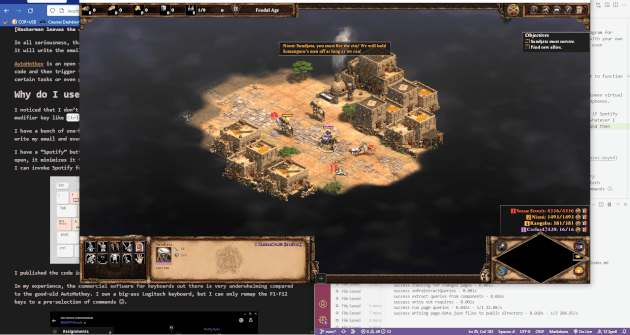

**[Hackerman enters the chat]**

_What is up fam, it's your boy **HACKERMAN**. Today I'm going to teach you how to make your ``g`` key write your email. Here's the AutoHotkey code:_

```
g::
SendInput cccarlos@duck.com
return
```

_That's all for today, you are welcome, don't forget to like and subscribe._

**[Hackerman leaves the chat]**

In all seriousness, that very silly piece of code will actually work. Every time you press ``g``, it will write the email instead of the letter G.

[AutoHotkey](https://www.autohotkey.com/) is an open source and free program for Windows that lets you program scripts using code and then trigger them with your own key combinations. It can be very effective to automate certain tasks or even personalize the way you interact with your PC.

# "You had me at "free", how do I use that thing?"

Ok step one: [download and install it](https://www.autohotkey.com/).

Create a file with the ``.ahk`` filename extension. Like ``test.ahk`` or something.

Open it up in your code editor of choice, you can also use notepad if you are a madlad.

Copy and paste this code and open the file.

```
;"^" is the ctrl key
;"!" is the alt key

;Types your email when you press Ctrl + Alt + G
^!g::
SendInput youremailhere@duck.com
return

; Media Keys
^!q::send {Volume_Down}
^!w::send {volume_up}
^!a::media_prev
^!s::media_play_pause
^!d::media_next
```

Hopefully you can already pick up the pattern by looking at that sample code, but here are some basics: 

Comments are written with ``;``

The `control` key is ``^``

The `alt` key is ``!``

The `shift` key is ``+``

There are plenty of things that you can do. [The documentation has got you covered](https://www.autohotkey.com/docs/v2/Hotkeys.htm). Some people have gone [really nuts with](https://www.youtube.com/watch?v=Arn8ExQ2Gjg) it but I like to keep it simple.

# How do I use AutoHotkey?

I noticed that I don't use the ``Caps Lock`` key, ever, so I remapped it to function as an extra modifier key like ``Ctrl`` or ``Alt``.

I have a bunch of one-handed commands to control my music, to switch between virtual desktops, write down my email address and even to change between my speakers and headphones.



I have a "Spotify" button, with ``Caps Lock + E``. It opens up Spotify. If I press it again it minimizes it and brings me back to whatever I was doing before. This is very useful if I want to change the music quickly but can't pause a game.

I published the code in my [Github](https://github.com/carlos815/bloq-mayus-puyed) if you want to take a look.


In my experience, the commercial software for keyboards out there is very underwhelming compared to the good-old AutoHotkey. I own a big-ass Logitech keyboard, but I can only remap the F1-F12 keys to a pre-selection of commands ☹. 


Granted, remaping ``Caps Lock`` is hardly an original idea. Redragon does it for some of their keyboards and call it "Magic Fn", but their software only works with Redragon keyboards and doesn't offer that much customization anyway (I tried it).


So if you truly want to call yourself a Hackerman and start using macros like a boss you'll have no choice than to go the AutoHotkey route.


