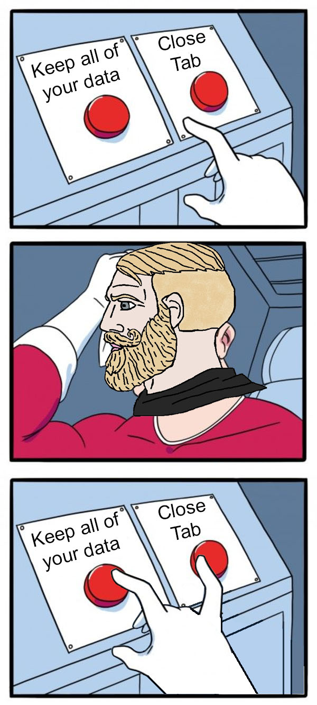

In this quick tutorial I will teach you how to make the data in the Context API persistent across reloads using the browser's built tools.

[We'll be making one of these.](https://codesandbox.io/s/persistent-context-api-counter-dzggiz)




The Context API in React allows you to create "global" variables that can be accessible to any component within your app, but it doesn't store anything in the browsers memory, you reload and poof!, all of your data resets to its initial state.


## Let's start up with a custom hook

We will store our data in the browser's memory with the help of the [LocalStorage API](https://developer.mozilla.org/en-US/docs/Web/API/Window/localStorage), which is available in all browsers.

`localStorage` by itself can be kind of clunky, it only supports text, so when you are reading or writing from it you have to convert your data.

This handy custom hook by [sanderdebr](https://dev.to/sanderdebr/building-a-custom-react-localstorage-hook-2bja) will help us with that, it uses ```JSON.stringify``` and `JSON.parse` to read and write our data and it can be used like any old hook within our app:

```ts
//https://dev.to/sanderdebr/building-a-custom-react-localstorage-hook-2bja
const useLocalStorage = (key: string, initialValue: any) => {
    const [storedValue, setStoredValue] = useState(() => {
        try {
            const item = window.localStorage.getItem(key);
            return item ? JSON.parse(item) : initialValue;
        } catch (err) {
            console.error(err);
            return initialValue;
        }
    });

    const setValue = (value: any) => {
        try {
            const valueToStore =
                value instanceof Function ? value(storedValue) : value;
            setStoredValue(valueToStore);
            window.localStorage.setItem(key, JSON.stringify(valueToStore));
        } catch (err) {
            console.error(err);
        }
    };
    return [storedValue, setValue];
};
```


```js
//Using the custom hook
const [niceValue, setNiceValue] = useLocalStorage("keyGoesHere", 69)
```

## Combining useLocalStorage with the Context API

A regular Context API provider looks like this. It sets up values using `useState` and then makes them available to every child component.

```jsx
export const DataProvider = ({ children }) => {
    const [counter, setCounter] = useState(0) //these values don't persist across reloads
    return <DataContext.Provider value={{ counter, setCounter }}>
        {children}
    </DataContext.Provider>
}
```

But that's for suckers, we can combine it with our useLocalStorage so it looks like this:
```jsx
export const DataProvider = ({ children }) => {
    //Our custom hook to save variables in the browser's memory
    const [counterStored, setCounterStored] = useLocalStorage("counter", defaultCounterValue)
    const [counter, _setCounter] = useState(defaultCounterValue)

    //The new and improved setCounter function. 
    const setCounter = (value) => {
        //It changes both the counter and the counterStored values to keep them in sync
        _setCounter(value)
        setCounterStored(value)
    }

    //initializing all the variables with their LocalStorage counterparts.
    useEffect(() => {
        _setCounter(counterStored)
    }, [])

    return <DataContext.Provider value={{ counter, setCounter }}>
        {children}
    </DataContext.Provider>
}
```

That's more like it! We can consume it as we normally would, and its state will stay even if you close the page :O
 ```jsx 
const Counter = () => {
  const { counter, setCounter } = useDataState() 
  return <div className='counter'>
    <p>{counter}</p>
    <button onClick={() => { setCounter(counter - 1) }}>-1</button>
    <button onClick={() => { setCounter(counter + 1) }}>+1</button>
  </div>
}
```

That's it! now you have Context API in steroids.

Want to recreate it? [Here's the link for the complete thing](https://codesandbox.io/s/persistent-context-api-counter-dzggiz).
