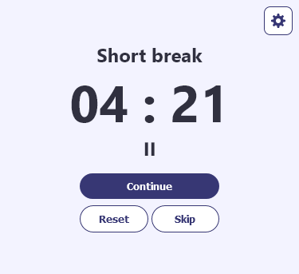
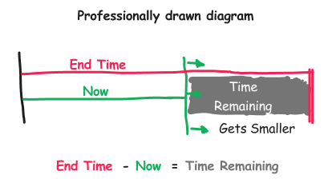
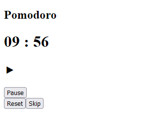
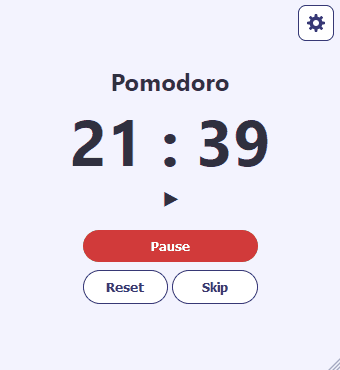

The pomodoro is a time management technique where you work for 25 minutes and rest for 5 minutes. It's a neat trick to keep yourself focused on a task for a long period of time without fatiguing yourself too much.

We are gonna' make one! You can [play around with the final project](https://pomodoro-context-api.vercel.app/) to get the hang about how it works and what it does.



## Previous knowledge required:

For this we will be using React with the Context API to share data between components easily. To follow along you should be familiar with the basics of React, custom hooks and some Typescript.

## Program requirements.

There are three types of timers:

- Pomodoro. 25 minutes. 
- Short break. 5 minutes.
- Long break. 10 minutes.

And the timer works with a playlist that loops forever and looks like this.

`Pomodoro` > `Short break` > `Pomodoro` > ` Short Break` > `Pomodoro` > `Short Break` > `Pomodoro` > `Long Break`

#### Core features                     
- When a timer ends, a notification pops up.
- You can pause, skip and reset the timer.
- You can edit the times of each timer, and the page remembers the settings.

#### This timer can continue running while it's closed.

This ain't your garden variety timer, it uses timestamps as a reference to calculate how much time has passed.

For example, say it's "January 12, 2023, 3:00 pm". When you start the timer, the app saves a timestamp we will call `endTime` with the value of "January 12, 2023, 3:25 pm". As we get closer to `endTime`, the time remaining will get shorter and shorter.



Now. The `endTime` gets stored in memory. When you close the page with the timer running and then open it up again, the page retrieves the `endTime` and recalculates the time remaining. That way it seems as if the timer magically kept running while the page was closed.

Animal Crossing does this. You plant a tree and turn off your console, and then when you come back the next day your plant has grown. The game kept progressing while it was off.


## Start a new project

I used the Next.js framework, but you can use plain React if you want, because I don't really use any of the Next.js special functions 😅. 

To create a new Next.js project just write this in your console in your project folder.

```bash
npx create-next-app@latest --typescript
```

Next.js comes with support for CSS modules out of the box and a sensible folder structure that you can use.

## Creating a basic interface

Go to your `pages/index.tsx` and replace everything with this:

```tsx
import Head from 'next/head'

export default function Home() {
  return (
    <>
      <Head>
        <title>Pomodoro Timer</title>
        <meta name="description" content="This is a pomodoro timer made with Context API" />
        <meta name="viewport" content="width=device-width, initial-scale=1" />
        <link rel="icon" href="/favicon.ico" />
      </Head>
      <main >
        <h2>{"Pomodoro"}</h2>
        <h1>{"09"} : {"56"}</h1>
        <h2>⯈</h2>
        <div >
          <button >Play</button>
          <div>
            <button disabled={false}>Reset</button>
            <button >Skip</button>
          </div>
        </div>
      </main>
    </>
  )
}
```

What we have there is our title, the timer, a status and a bunch of buttons. I won't cover styles in this post, so you are encouraged to go nuts on this one.



It's looking pretty good!

## Set up a data provider with the Context API.

We will set up a data provider component using the Context API. This component will make data available to all of its child components without having to pass it as props.

Create a new file called `localStorage.tsx` inside of a `lib` folder in your root. We will start off with a simple component that just exports a `value` and a `setValue` function. We will expand this as we go. 

```tsx
// Thanks to ChatGPT for adding in the comments
import { createContext, useContext, useState, ReactNode } from 'react';

// creates a type that defines the shape of the context object, 
// which has a value property of type number and a setValue property of type Function.
type LocalStateContextType = {
    value: number,
    setValue: Function,
}

// creates a context object with the shape defined by LocalStateContextType, 
// and sets the initial value of value to 0 and a default warning message if 
// setValue is called before the context is initialized.
const LocalStateContext = createContext<LocalStateContextType>({
    value: 0,
    setValue: () => console.warn("no local state yet"),
});

const LocalStorageStateProvider = LocalStateContext.Provider;

export default function LocalStorageProvider({ children }: { children: ReactNode }) {
    // sets the initial state of value to 0, 
    // and it creates a setValue function that can be used to update the state.
    const [value, setValue] = useState(0)
    
    // renders the LocalStorageStateProvider component and passes the value and setValue
    // state variables as the value prop.
    return <LocalStorageStateProvider value={{value, setValue }}>
            {children}
        </LocalStorageStateProvider>
}

// defines a hook function that retrieves the context object, and returns it.
function useLocalStorageState() {
    const all = useContext(LocalStateContext);
    return all;
}

export { LocalStorageProvider, useLocalStorageState };
```

Next up, we will hook this up. Go to `pages/_app.js` and put `LocalStorageProvider` so its a parent of all components inside the page. If you are in React, you can put it inside the `App` component.

```tsx
// pages/_app.js
import '../styles/globals.css'
import type { AppProps } from 'next/app'
import LocalStorageProvider from '../lib/localStorage'

export default function App({ Component, pageProps }: AppProps) {
  return <LocalStorageProvider>
      <Component {...pageProps} />
  </LocalStorageProvider>
}
```

The set up is done. Now, to use it in any file you want you need to import ``useLocalStorageState`` like this: 

``` tsx
import { useLocalStorageState } from '../lib/localStorage'

const SomeComponent = () => {
    const { value, setValue } = useLocalStorageState()
    return <div>
        <p>{value}</p>
        <button onClick={() => { setValue(value - 1) }}>-1</button>
    </div>
}
```

## Make your LocalStorageProvider save its state in the browser

This is how we enable that neat Animal Crossing trick. We want to make our ``LocalStorageProvider`` read to and from the memory so it can restore its state once you come back to the page.

[I have an article that explains how to do that](https://carloshernandez.me/blog/en/persistent-context-api-in-react/), but the final code should look something like this:

```tsx
// localStorage.tsx
...
export const LocalStorageProvider = ({ children }) => {
    const [valueStored, setValueStored] = useLocalStorage("value", 0)
    const [value, _setValue] = useState(0)

    const setValue = (val) => {
        _setValue(val)
        setValueStored(val)
    }

    useEffect(() => {
        _setValue(valueStored)
    }, [])

    return <LocalStorageStateProvider value={{ value, setValue }}>
        {children}
    </LocalStorageStateProvider>
}
...
```

Remember that you need to create a ``useLocalStorage`` component too. It's all in [the article](https://carloshernandez.me/blog/en/persistent-context-api-in-react/).

## Create the types

This part is specific to using typescript. We will create some of the types we will need throughout the app.

Create a `types.ts` file inside of a folder called `shared`.

```ts
// shared/types.ts
// The status of the timer.
export enum Status {
    Start = "start"
    Play = "play",
    Pause = "pause",
    Ended = "ended",
}

// Pomodoro, short break and long break are timer types
export type timerType = {
    name: String,
    duration: number,
}

// An object that will hold a collection of all our timerType objects
export interface TimerTypes {
    [key: string]: timerType;
}
```

## Create the constants

In that same shared folder, create a `constants.ts` file.

```ts
// shared/constants.ts
import { TimerTypes } from "./types"

export const defaultTimers: TimerTypes =
{
    pomodoro: {
        name: "Pomodoro",
        duration: 1500000
    },
    longBreak: {
        name: "Long break",
        duration: 600000
    },
    shortBreak: {
        name: "Short break",
        duration: 300000
    }
}

export const initialPlaylist = [
    "pomodoro",
    "shortBreak",
    "pomodoro",
    "shortBreak",
    "pomodoro",
    "shortBreak",
    "pomodoro",
    "longBreak",
]

```

## Creating the variables in our LocalStorageProvider component.

Right now, our `LocalStorageProvider` just serves `value` and the `setValue` setter. Let's replace that with the variables that our timer needs. We need just 6 variables, with their respective setters.

It will make sense what they are for once we start using them in a sec.

- **timerSettings**: a TimerTypes. (defined in our typescript file from earlier).
- **playlist**: A list of strings.
- **timer**: It's a timerType. This will be the timer type currently in use.
- **timeRemaining**: A number. It's the time remaining in milliseconds.
- **status**: We created the Status enum earlier.
- **endTime**: A number. It's the time when the timer should end in milliseconds.

You could start creating them on your own if you want some practice with Typescript and the Context API. You might not know what to put in the default values because I haven't explained what they are for yet, so copy them [from here](https://github.com/carlos815/pomodoro-context-api/blob/main/lib/localStorage.tsx).

## Creating another context provider thingie

Now we will create another content provider called `TimerProvider`. While our first one just stored data, this one will contain the actual logic our timer needs to function.

TimerProvider exports the `playPause`, `reset` and `skip` functions, and the value of `now`.
```jsx
// lib/timer.tsx
import { createContext, useContext, useState, ReactNode } from 'react';

export type LocalStateContextType = {
    playPause: Function,
    reset: Function,
    skip: Function,
    now: number,
}

export const LocalStateContext = createContext<LocalStateContextType>({
    playPause: () => console.warn("no local state yet"),
    reset: () => console.warn("no local state yet"),
    skip: () => console.warn("no local state yet"),
    now: 0,
});

export const LocalStateProvider = LocalStateContext.Provider;

export default function TimerProvider({ children }: { children: ReactNode }) {
    const [now, setNow] = useState(0)
    const playPause = () => {}
    const reset = () => {}
    const skip = () => {}

    return <LocalStateProvider value={{playPause, reset, skip, now}}>
        {children}</LocalStateProvider>
}

function useTimer() {
    const all = useContext(LocalStateContext);
    return all;
}

export { TimerProvider, useTimer };
```

You'll also need to hook this one up to your root component [like this](https://github.com/carlos815/pomodoro-context-api/blob/main/pages/_app.tsx)

## Updating the value of our 'now' variable.

If you refer back to the professionally drawn diagram from earlier, our `now` variable is represented by a green line that it's always moving forward. This is just the current time in milliseconds. You can access it with `Date.now()` in the browser.

We will use an `useEffect` to update the value inside the browser. We will put it inside a `setInterval` so the value keeps updating every 250 milliseconds, or 1/4 of a second:

```js
// lib/timer.tsx
// ...
useEffect(() => {
    const interval = setInterval(() => {
        setNow(Date.now())
    }, 250)
    return () => clearInterval(interval)
}, [])
// ...
```

## Import all of our variables from LocalStateProvider.

There are a lot of them. 

```js
// lib/timer.tsx
// ...
const {
        timerSettings,
        playlist,
        setPlaylist,
        timer,
        setTimer,
        timeRemaining,
        setTimeRemaining,
        status,
        setStatus,
        endTime,
        setEndTime
   } = useLocalStorageState()
// ...
```

## The play function

When we press play, firstly we want to set the status of the timer to playing. We can do that with `setStatus(Status.Play)`.

Secondly, we want to calculate the `endTime` and store it. This is that moment in the future when the timer should end. So we need to add the time remaining to `now`. There's a value called `timeRemaining` that we imported from our `useLocalStorageState` that we can use.

```jsx
const play = () => {
    setStatus(Status.Play)
    setEndTime(timeRemaining + now)
}
```

#### Now an overdue explanation about some variables in useLocalStorageState

###### timerSettings:

It starts off being equal to defaultTimers. Which we have in [our constants file](https://github.com/carlos815/pomodoro-context-api/blob/main/shared/constants.ts). It defines the names of the timers and the duration of each one.

```ts    
const [timerSettings, _setTimerSettings] = useState<TimerTypes>(defaultTimers)
```

###### timer:

This is the currently active timer. It uses the first element in the [playlist array](https://github.com/carlos815/pomodoro-context-api/blob/main/shared/constants.ts) as a key to timerSettings.

```ts    
const [timer, _setTimer] = useState<timerType>(timerSettings[playlist[0]])
```

###### timeRemaining:

Its initial value is the duration of `timer`

```ts    
const [timeRemaining, _setTimeRemaining] = useState<number>(timer.duration)
```

## The pause function

We want to set the status to pause and update the time remaining.

```jsx
const pause = () => {
    setStatus(Status.Pause)
    setTimeRemaining(endTime - now)
}
```

The timeRemaining will be the difference between the endTime and now. The gray area in the diagram from earlier.


## The functions for the buttons.

Our app has only three buttons, playPause, reset and skip. Let's create functions for them.

#### playPause

This function needs to do different things depending on the status of the timer. This is a nice excuse to use javascript's switch statement.

```jsx
 const playPause = () => {
        switch (status) {
            case Status.Start:
            case Status.Pause:
                play()
                break
            case Status.Play:
                pause()
                break      
            case Status.Ended:
                skip() //We need to create this function
                break
            default:
                console.error("Play status not recognized")
        }
    }
```

#### Reset

This function restores the timeRemaining to its initial value and sets the status to start.

```tsx
const reset = () => {
    setStatus(Status.Start)
    setTimeRemaining(timer.duration)
}
```
#### Skip

This function removes the first item in `playlist` array and puts it back in the last spot. Then uses the first item in the modified array to set up a new timer.

So this

`1` > `2` > `3` > `4`

Becomes this

`4` > `1` > `2` > `3`

```tsx
const skip = () => {
    //Sending the first item in the playlist to the last spot
    const _playlist = playlist;
    const _firstItem = _playlist[0]
    _playlist.shift()
    _playlist.push(_firstItem)
    setPlaylist(_playlist)

    //Create a new timer using the new first item in the playlist as a key in timerSettings
    const newTimer = timerSettings[_playlist[0]]
    setUpNewTimer(newTimer)
}

const setUpNewTimer = (newTimer: timerType) => {
    setTimer(newTimer)
    setTimeRemaining(newTimer.duration)
    setStatus(Status.Start)
}
```

## The ended function

Ok this is the last function I swear. This is what happens when the timer reaches its end. The status is set to ended, and a notification triggers.
```tsx
const ended = () => {
    setStatus(Status.Ended)
    setTimeRemaining(0)
    //TODO: Play notification here
}
```

We can check if the timer has reached zero every time `now` changes to trigger the `ended` function.

```jsx
useEffect(() => {
    // This is a listener of sorts.
    if (status == Status.Play && (endTime - now) < 0) {
        ended()
    }
}, [now])
```

Ok that was a lot of code. Our `lib/timer.tsx` should look [like this](https://github.com/carlos815/pomodoro-context-api/blob/main/lib/timer.tsx)


## Creating the interface

Now we are finally, FINALLY, be able to show something in our app.

Go to your `pages/index.tsx` and import the `useTimer` and the `useLocalStorageState`.

```tsx
import { useLocalStorageState } from '../lib/localStorage'
import { useTimer } from '../lib/timer'
...
export default function Home() {
  const { playPause, reset, skip, now } = useTimer()
  const { status, timeRemaining, endTime, timer } = useLocalStorageState()
...
```

Let's start with the hard part. The timer.

#### The time indicator.

Create this constant:
```tsx
  const onScreenTime = status == Status.Play ? endTime - now : timeRemaining
```

If the timer is running, you show `endTime - now`, else just show time remaining. They are technically the same, but remember that `now` updates every 250 ms.

This time is expressed in milliseconds. You could just throw onScreenTime in the interface and be done with it, but we ain't cavemen.


We will express that hot mess in seconds and minutes.These functions will help:

```tsx
const minDigits = (numStr: String, digits: Number) => {
  while (numStr.length < digits) {
    numStr = '0' + numStr
  }
  return numStr
}

const getMinutes = (timeStamp: number, digits = 2): String => {
  return minDigits((Math.floor((timeStamp) / 1000 / 60 % 99)).toString(), digits)
}

const getSeconds = (timeStamp: number, digits = 2): String => {
  return minDigits((Math.floor((timeStamp) / 1000 % 60)).toString(), digits)
}
```

Now in our interface, we go:

```tsx
<h1 >{getMinutes(onScreenTime)} : {getSeconds(onScreenTime)}</h1>
```

#### Everything else

You can now show the name of the current timer dynamically.

```tsx
<h2>{timer.name}</h2>
```

And put the playPause, reset, and skip functions in the buttons in their respective buttons.

```tsx
...
<div >
      <button onClick={() => {playPause()}}>Play</button>
      <div>
        <button onClick={() => {reset()}} >Reset</button>
        <button onClick={() => {skip()}}>Skip</button>
      </div>
</div>
...
```

You can use the `status` to show something different depending on the value.

```tsx
const statusIndicator = () => {
  switch (status) {
    case Status.Start:
      return "-- "
    case Status.Play:
      return "⯈"
    case Status.Pause:
      return "❙❙"
    case Status.Ended:
      return "✓"
    default:
      return "--"
  }
}
```
And then.
```tsx
<h2>{statusIndicator()}</h2>
```
If you want to do something fancier than that, like using SGVs, it's more organized if you create a separate component that could either receive the Status as a prop or get it from useLocalStorageState.

## Notifications. The final touch.

A timer that doesn't beep when it ends it's super lame. Let's fix that.

Create a file called notifications.js in your lib folder with this:

```js
// lib/notifications.js
export const requestNotificationPermission = () => {
  if (Notification.permission !== 'granted') {
    Notification.requestPermission(function (status) {
      console.log('Notification permission status:', status)
    })
  }
}

export const displayNotification = (text, options) => {
  if (Notification.permission === 'granted') {
    Notification.onclick = (event) => {
      event.preventDefault(); // prevent the browser from focusing the Notification's tab
      window.open('http://www.mozilla.org', '_blank');
    }
    new Notification(text, {
      icon: '../tomato-icon.png', //Your own icon here. Put it in the public folder
      ...options,
    })
  }
}
```

In order to be able to trigger a notification you need to ask the user for permission. That's what the `requestNotificationPermission` is for. You can only do it after the user has interacted with the page. So you could put it in the `playPause` function.

```tsx
// lib/timer.tsx
const playPause = () => {
      requestNotificationPermission() //Here!
      switch (status) {
          (...)
      }
  }
```

Then you can send them once the timer has ended with `displayNotification`.
```tsx
// lib/timer.tsx
const ended = () => {
      displayNotification(`${timer.name} ended.`, { body: "You are doing great!" })
      setStatus(Status.Ended)
      setTimeRemaining(0)
  }
```

For more information on how these two work, I recommend [Mozilla's article about notifications](https://developer.mozilla.org/en-US/docs/Web/API/notification).

## Wrapping it up!

So this was my longest post to date. if you get lost during all of this, I don't blame you, because that was a lot. Feel free to look at the [source code](https://github.com/carlos815/pomodoro-context-api).

If you want to expand on this, you can try adding sounds to it, the ability to change the duration of the timers and even a history of the timers completed.

I hope you found this useful. Thank you for reading. 


