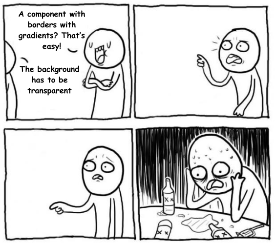

_If you are not interested in my ramblings and just came in for the code, here it is in all its glory_:
```scss
//style.scss
$border-radius: 4px;
$border-width: 1px;
.button {
    display: flex;
    color: white;
    position: relative;
    z-index: 0;
    border-radius: $border-radius;
    padding: 8px 16px;

    &::before {
        border-radius: $border-radius;
        content: "";
        position: absolute;
        z-index: -1;
        inset: 0;
        padding: $border-width; //Border goes in the padding property 
        background: linear-gradient(to top right, #ADFF00, #0066FF);
        -webkit-mask:
            linear-gradient(#fff 0 0) content-box,
            linear-gradient(#fff 0 0);
        mask:
            linear-gradient(#fff 0 0) content-box,
            linear-gradient(#fff 0 0);
        -webkit-mask-composite: xor;
        mask-composite: exclude;
    }
}
```
---


Recently at work I was tasked with a seemingly simple task: Make a button with a border gradient. The border is rounded, and the button is transparent.


Simple enough! CSS doesn't really support gradients in its border property, but this is nothing some classic front-end jankyness can't solve:

You just have to have use a ``::before`` element that has the gradient and then cover most of it with the background of the button so just the border shows.



## That transparent background, man.

This task sent me into the five stages of grief, and after wasting more time that I'm willing to admit, and consulting with the rest of the front-end team, I had to mouth the shameful four words no front-end programmer wants to say to a designer:

> It can't be done

The dishonor.

We settled with a compromise: change the transparent background with a black one, which admittedly, looked almost identical in most situations where the button was being used.

In my little meeting of dishonor and shame with the design crew, I used Codepen's page as an example, to convince them (and myself) that it indeed was an impossible thing to do given the current state of the CSS.


But I couldn't let it go, every time I say the button, it was a reminder of the failure. There HAD to be a way. A month later, I went back to the rabbit hole, and I was set on solving the problem for good.

## First lead, Figma 🕵️‍♀️

So my first approach was to use the browser's inspect tool to find out what the hell Figma is doing under the hood, they can do rounded border gradients like it's nothing, and they do it all in a browser.


I didn't find anything 🙁. Everything in Figma is inside of a `<canvas>`.

Figma has it's own 2D rendering engine in [Web Assembly](https://www.figma.com/blog/webassembly-cut-figmas-load-time-by-3x/), so they aren't really using divs and javascript like the rest of the mortals.


## Second lead, the border-image property.

The page CSS-tricks as [a whole article on gradient border properties](https://css-tricks.com/gradient-borders-in-css/), problem is, the article is from 2018.

They talk about the `border-image` property from CSS. They have a [demo](https://codepen.io/chriscoyier/pen/ZVYXRx) where they show the gradient borders with the transparent background, but the borders aren't rounded.


They say that the property is not compatible with `border-radius`, but that was in 2018 and maybe, just maybe, it works now.

[NARRATOR: It doesn't.]

## The 9-silce scaling

The CSS tricks article above let me into another rabbit hole.

The [9-slice scaling](https://en.wikipedia.org/wiki/9-slice_scaling) is a technique for resizing 2D images by dividing the image in 9 parts. I think this is what the old Pokemon games used for their borders in the dialog boxes (don't quote me on that).


This is something [CSS actually supports](https://developer.mozilla.org/en-US/docs/Web/CSS/border-image-slice) with the `border-image-slice` property. As far a I can tell it has been used exclusively for making tacky borders that look like they came straight out of 1995.

So maybe, if I divide the button in nine parts, and then find the exact color on each of the cutoff points, I can make a separate SGV for each section. Then I can put them together using `border-image-slice`. That way it'll scale and everything. It'll be perfect!.


I got dangerously to going through with that plan, but it had too many drawbacks. First of all, changing colors, border radiuses or even the widths, would have required me to redo all of the SGVs. Secondly, if anyone looked at my code, they would have found out that I'm a mad man.

## Then I saw the light

[Temani Afif](https://stackoverflow.com/users/8620333/temani-afif), a self-proclaimed Expert CSS Hacker, made [a post in Stack Overflow](https://stackoverflow.com/questions/51496204/border-gradient-with-border-radius) that somehow eluded my searches.

It all can be done using [the Mask property](https://developer.mozilla.org/en-US/docs/Web/CSS/mask).

```scss
...
padding: $border-width;
background: linear-gradient(to top right, #ADFF00, #0066FF);
mask: linear-gradient(#fff 0 0) content-box,
      linear-gradient(#fff 0 0);
mask-composite: exclude;
...
```

The final code is at the begining of this post, so I'm just showing the interesting part.

You can use a `::before` pseudoelement with the gradient, just like my initial plan, but you can cut off the middle using masks. Then, to set up the width, you can use the padding property.

There. Done. It's so simple once you have the answer.

After I finally did it, I presented my work to the design team crowd as if I just solved global warming, and they seemed unimpressed. 

> Meh. The design team - 2023

Apparently they have _moved on_ from that task, whatever that means, and they weren't thinking about that button anymore. The previous version with the black background did look almost the same, and they have grown accustomed to it after looking it for so long.

A month after, they changed the button to a cleaner looking one that doesn't use gradients at all 🤡.