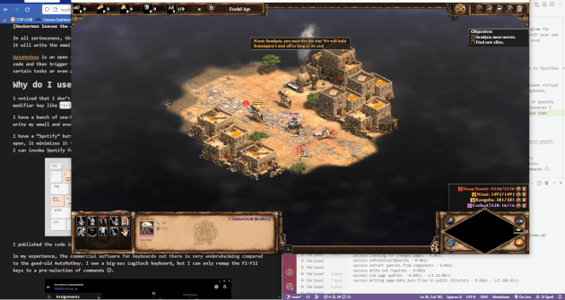
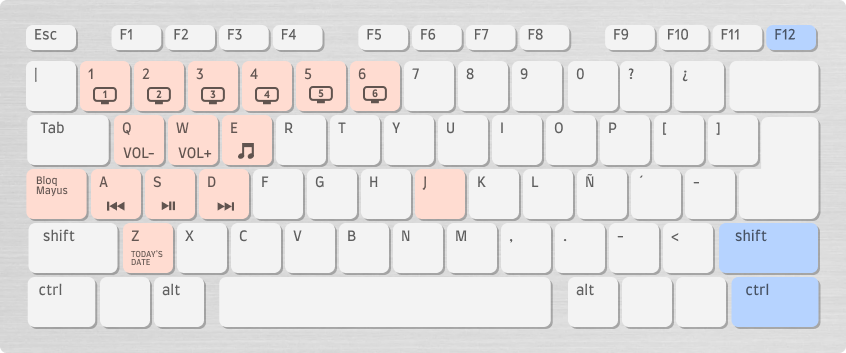
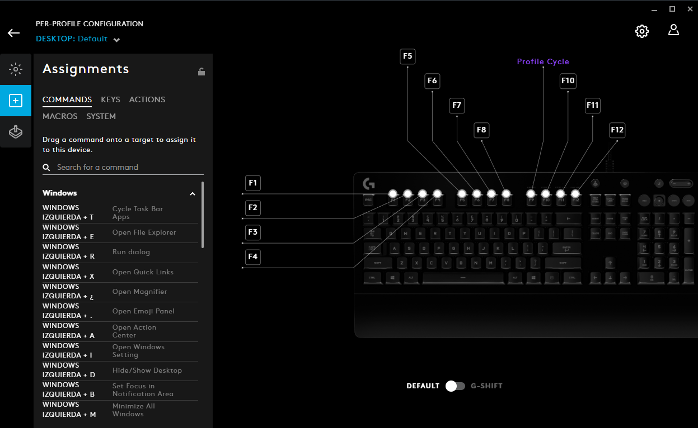
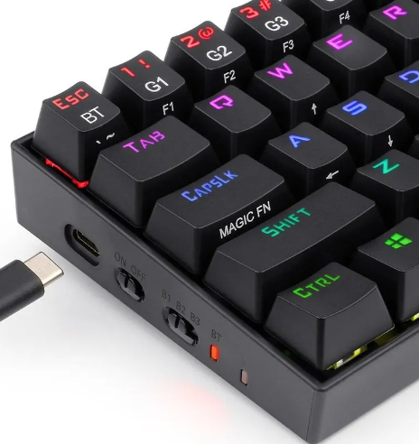

**[Hackerman ha ingresado al chat]**

_¿Cómo está todo mi gente? Soy yo, **HACKERMAN**. Hoy les traigo un tutorial para hacer que la tecla ``g`` escriba tu correo. Este es el código de AutoHotkey:_

```
g::
SendInput cccarlos@duck.com
return
```

_Eso es todo por hoy, de nada, no olviden suscribirse y darle like._

**[Hackerman ha dejado el chat]**

Pero en serio, esas tres líneas de código tan ridículas funcionan. Cada vez que presiones ``g``, se escribirá el email en lugar de la letra G.

[AutoHotkey](https://www.autohotkey.com/) es un programa de código abierto y gratuito para Windows que te permite programar automatizaciones con código y luego activarlas con tus propias combinaciones de teclas. Puede ser muy eficaz para automatizar ciertas tareas o incluso personalizar la forma en que interactúas con tu PC.

# "Me convenciste con lo de gratis, ¿cómo uso esa cosa?"

Ok paso uno: [descárgalo e instálalo](https://www.autohotkey.com/).

Crea un archivo con la extensión ``.ahk``. Puede ser ``test.ahk`` o algo así.

Ábrelo en tu editor de código preferido, también puedes usar el bloc de notas si eres un psicópata.

Copia y pega este código y ejecuta el archivo.

```
;"^" es la tecla ctrl
;"!" es la tecla alt

;Escribe tu email cuando pulses Ctrl + Alt + G
^!g::
SendInput tocorreoaqui@duck.com
return

; Teclas multimedia
^!q::send {Volume_Down}
^!w::send {volume_up}
^!a::media_prev
^!s::media_play_pause
^!d::media_next
```

Con un poco de suerte ya habrás captado el patrón al ver ese código de ejemplo, pero aquí tienes algunos conceptos básicos: 

Los comentarios se escriben con ``;``

La tecla `control` es ``^``.

La tecla `alt` es ``!``

La tecla `shift` es ``+``.

Se puede hacer un montón de cosas. [En la documentación sale bien explicado](https://www.autohotkey.com/docs/v2/Hotkeys.htm). Algunas personas se [van al extremo](https://www.youtube.com/watch?v=Arn8ExQ2Gjg) pero a mi me gusta usarlo para cosas sencillas.

# ¿Cómo uso AutoHotkey?

Me di cuenta de que yo no uso la tecla ``Bloq Mayús`` (Caps Lock),  nunca, así que la modifiqué para que funcione como una tecla modificadora extra como ``Ctrl`` o ``Alt``.

Tengo un montón de comandos para controlar mi música con una sola mano, cambiar entre escritorios virtuales, escribir mi dirección de correo electrónico e incluso cambiar entre mis altavoces y auriculares.



El mejor es el botón "Spotify". Con ``Bloq Mayús + E`` abro Spotify. Si lo vuelvo a presionar, se minimiza y me devuelve a lo que estaba haciendo antes. Esto es super útil cuando quiero cambiar la música rápidamente pero no puedo pausar un juego.

Mi código está en [Github](https://github.com/carlos815/bloq-mayus-puyed) por si le quieres echar un ojo.



En mi experiencia, el software comercial para teclados que hay por ahí es muy decepcionante en comparación con el viejo confiable AutoHotkey. Tengo un teclado Logitech de los grandes, pero sólo puedo reasignar las teclas F1-F12 a una preselección de comandos ☹. 



Realmente lo de reasignar ``Bloq Mayús`` no es una idea original. Redragon lo hace para algunos de sus teclados super compactos y lo llama "Magic Fn", pero su software sólo funciona con teclados Redragon y no ofrece tanta personalización de todas formas.



Así que si realmente quieres empezar a usar macros en Windows como un hacker no te queda de otra que aprender AutoHotkey. Lo recomiendo, de pana no es tan difícil.


