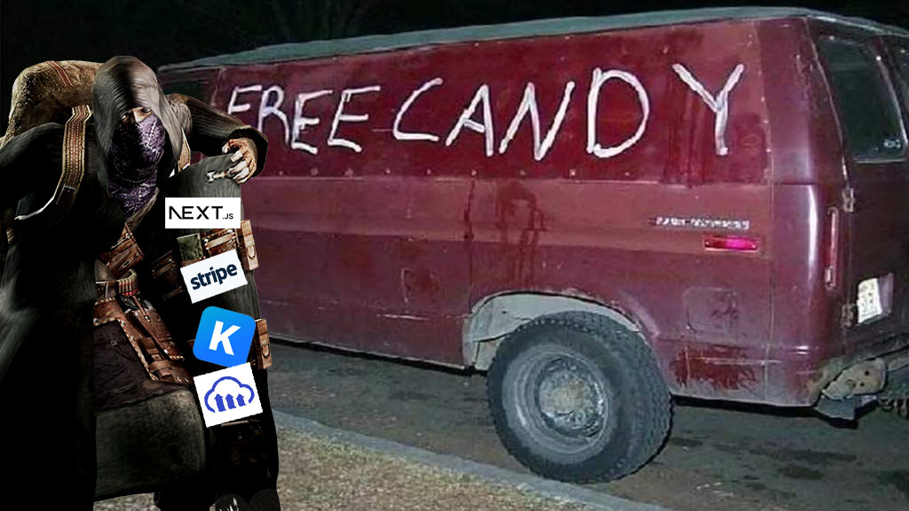
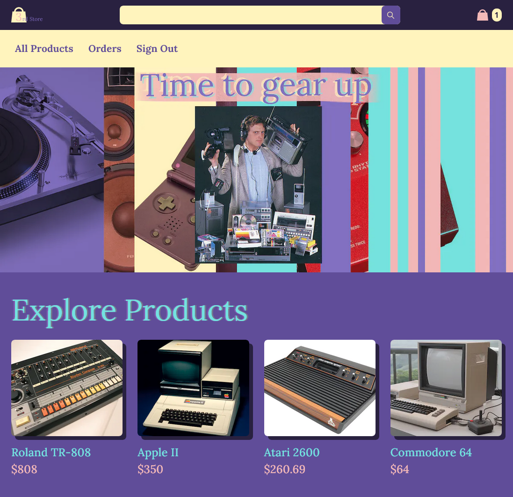
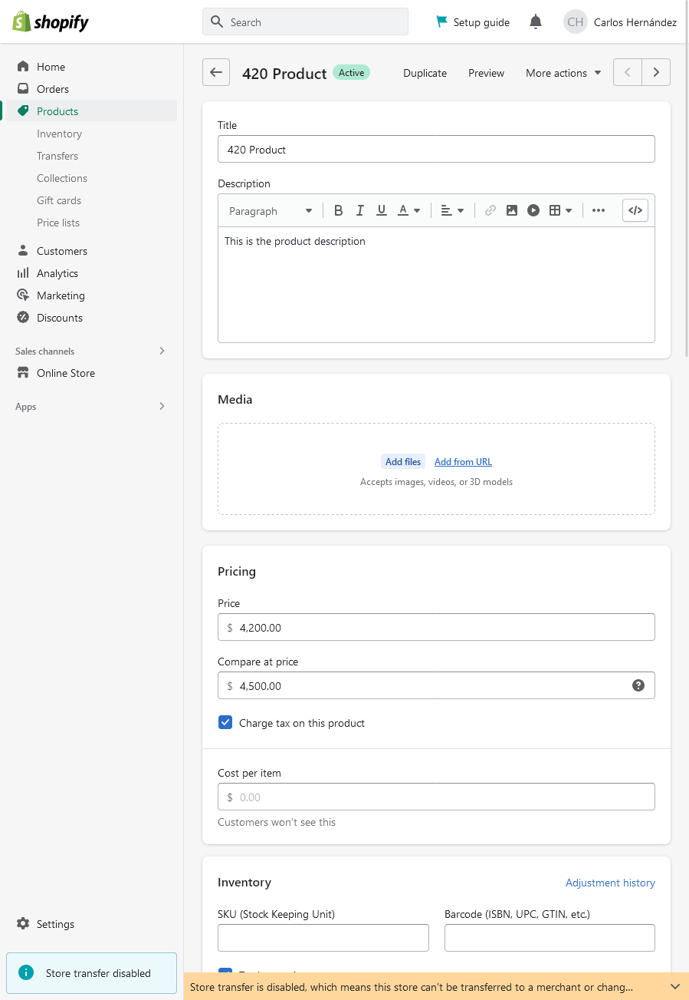
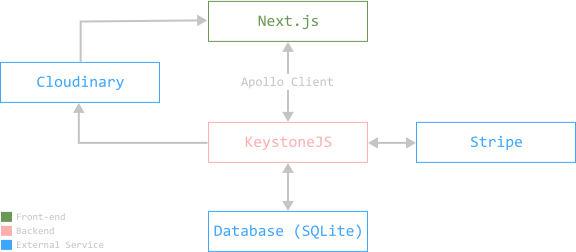
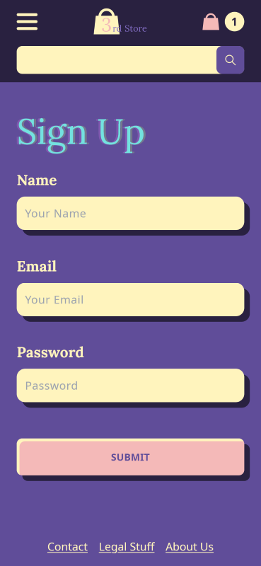

> Hey chico, ¿quieres desarrollar tu propia tienda online totalmente personalizable y modular sin
> Shopify gratis? También estoy regalando caramelos

Normalmente, no deberías tomarte en serio este tipo de ofertas, pero estamos en 2023. El desarrollo web ha avanzado mucho, y esto no es tan descabellado como parece.



En este post te explicaré TODO* lo que necesitas saber para construir **tu propia tienda online funcional usando sólo cosas gratis**.

\*Bueno, no *todo*, esto no será un tutorial super completo (que vendrá más adelante si hay demanda), sino una visión general de todas las tecnologías que necesitas para arrancar. Puedes usar esto como una guía general, con enlaces a la documentación oficial donde encontrarás la información más actualizada para aplicar estas ideas.

Hice [una tienda online de mentira](https://3rd-shop.vercel.app/) utilizando estos conceptos. Como puedes ver, funciona, pa que veas que es verdad la broma.



[Este](https://github.com/carlos815/3rd-shop-frontend) es el código fuente del frontend.

[Este](https://github.com/carlos815/3rd-shop-backend) es el código fuente del backend.

Y [este](https://www.figma.com/file/9ggHbHWHxIXkcL0kUdF5Q0/3rd-Shop?node-id=9%3A241&t=QSw2DVPTPc4OyzmR-1) es mi diseño en Figma.

Pasé demasiadas de horas tratando de entender todo esto, incluso después de pagar por este [curso de Wes Bos](https://advancedreact.com) sobre eso. 


## ¿Por qué no usar Shopify y ya?

Shopify es tremendo producto, son como el Wordpress de las tiendas online, y lo digo como algo bueno.


### Tienen puntos a favor:
- Un Sistema de Gestión de Contenidos (CMS para la gente cool) *muy* robusto.
- Gestión de pagos.
- Hosting. De todo. Esto incluye la página de la tienda, la base de datos con la información del producto, el alojamiento de imágenes... 
- Un montón de plugins para un montón de escenarios comunes.
- E incluso plantillas de diseño de tiendas, para pequeños negocios que no necesitan un diseñador web.



### Pero también tienen cosas malas:

- Su servicio cuesta dinero, entendiblemente.
- Son muy limitados en cuanto a personalización.

Esto significa que si encontramos una alternativa para al menos el CMS, la gestión de pagos y el hosting, podemos quedarnos con el chivo y el mecate también.

## ¿Qué otra tecnología podemos utilizar?

Te presento el stack de tecnologías oficial de los desarrolladores que quieren hacer una tienda online pero son pobres.



Nuestro stack de tecnologías es el siguiente:
 - **Next.js**. Una librería React para nuestro front-end.
 - **Apollo Client**. Cómo interactúa el front-end con el back-end.
 - **KeystoneJS**. El backend. Incluye el CMS.
 - **SQLite**. La base de datos. Para producción necesitas cambiar esto a Postgres o MySQL.
 - **Cloudinary**. El servicio de hosting de imágenes.
 - **Stripe**. El procesador de pagos.

## Lista de pasos para hacer una tienda

**Nota**: *Tendrás dos proyectos en los que trabajar, el Front end con Next.js y el backend con KeystoneJS. Es decir que tendrás al menos dos ventanas. Si estás usando VSCode puedes usar [esta extensión](https://marketplace.visualstudio.com/items?itemName=stuart.unique-window-colors) para autogenerar los colores de las ventanas. Esto hace que sea más fácil diferenciarlas cuando estás cambiando constantemente entre ellas.*

### Configuración Inicial:

1. [**Crea un nuevo proyecto de Next.js**](https://nextjs.org/docs/getting-started) y [**un nuevo proyecto de KeystoneJS**](https://keystonejs.com/docs/getting-started). 
2. [**Instala el cliente Apollo en tu proyecto Next.js**](https://www.apollographql.com/docs/react/get-started#step-2-install-dependencies).
3. [**Conecta Apollo Client a Keystone**](https://www.apollographql.com/blog/apollo-client/next-js/next-js-getting-started/#creating-a-new-next-js-app). Recuerda ir a tu ``pages/_app.js`` y meter el ``<Component {...pageProps} />`` en un ApolloProvider. En el enlace sale todo eso.
4. **Dale a Keystone la url de tu frontend**. Si no lo haces el [Sr. Cors](https://developer.mozilla.org/en-US/docs/Web/HTTP/CORS) te va a regañar. Simplemente copia [el ejemplo de Keystone](https://keystonejs.com/docs/config/config#server) y sustituye la url por la de tu servidor local.
5. **Prueba una [consulta en Next.js](https://www.apollographql.com/docs/react/data/queries/) para ver si se conecta**. Por defecto, el servidor tiene posts, así que podrías crear un post en el CMS de Keystone y consultarlo con: 

```graphQl
query {
  posts {
    title
    content {
      document
    }
  }
}
```

### Schemas personalizados:

Los esquemas, o schema, son modelos de datos. Por defecto, KeystoneJS viene con esquemas para usuarios y posts. Para nuestra tienda necesitamos schemas de producto, elementos del carrito, pedidos y elementos de pedido. 


1. [**Instala y configura Cloudinary Image en tu backend**](https://keystonejs.com/docs/fields/cloudinaryimage). Necesitarás crear una cuenta Cloudinary para obtener esas claves API.
2. [**Crea un esquemas personalizado para las imágenes de tus productos**](https://github.com/carlos815/3rd-shop-backend/blob/main/schemas/ProductImage.ts).  Una vez configurado, las imágenes que subas a través del CMS KeystoneJS se subirán automáticamente a Cloudinary (super cool).
3. [**Crear un esquema personalizado para los productos**](https://github.com/carlos815/3rd-shop-backend/blob/main/schemas/Product.ts). El cielo es el límite aquí. Tu producto puede tener un nombre, una descripción, una o varias imágenes (de tu esquema personalizado de imágenes de producto), un precio, un usuario al que pertenecen, nivel de inventario, estado de relación, cédula o estado de vacunacion del covid.
4. **Cree un esquema personalizado para todo lo demás**. Necesitas al menos artículos del carrito, pedidos y artículos del pedido. [Aquí te los tengo](https://github.com/carlos815/3rd-shop-backend/tree/main/schemas).

### Autenticación de usuarios:
La autenticación debería funcionar en el backend, [tienen un montón de mutaciones y consultas](https://keystonejs.com/docs/config/auth) para ayudarte a implementar la autenticación de usuario en tu página muy rápidamente. 



1. **Crea una página de inicio de sesión**.  La mutación para iniciar sesión se llama ``authenticateUserWithPassword``. Vela en uso [aquí](https://github.com/carlos815/3rd-shop-frontend/blob/main/pages/signin.tsx).
2. **Crear una página de registro**. [Hay una mutación para crear usuarios](https://keystonejs.com/docs/graphql/overview#create-user). Ejemplo [aquí](https://github.com/carlos815/3rd-shop-frontend/blob/main/pages/signup.tsx).
3. **Comprueba si el usuario ha iniciado sesión o no, para mostrar cosas diferentes en la página**. Puedes consultar ``authenticatedItem`` para ver eso. Incluso puedes [crear un hook personalizado](https://github.com/carlos815/3rd-shop-frontend/blob/main/components/User.js) para saber si el usuario ha iniciado sesión desde cualquier componente y cambiar la interfaz de usuario en base a esa información. 
4. **Crear un botón de cierre de sesión**. Hay una mutación llamada ``endSession`` que simplemente cierra la sesión del usuario. [Aquí hay un botón](https://github.com/carlos815/3rd-shop-frontend/blob/main/components/SignOut.jsx) que lo utiliza.

### Implementar el Carrito:

> El "carrito" no existe realmente, no está almacenado en algún sitio, es sólo un concepto 🤯

Nah, pero en serio, no necesitas tener un esquema para "Carrito" que contenga los artículos de carrito. Se puede traer una colección de "artículos de carrito" pertenecientes a un usuario en particular, ya ese es tu carrito.

1. [**Crear mutaciones personalizadas para añadir y eliminar elementos del carrito**](https://keystonejs.com/docs/guides/schema-extension#using-keystone-s-graphql-extend). El front-end sólo debe darle el id del producto, y el back-end debe encargarse del resto, creando el artículo del carrito para ese usuario, y si ya está creado, entonces añadir uno a la cantidad. [Así](https://github.com/carlos815/3rd-shop-backend/blob/main/mutations/addToCart.ts).
2. [**Utiliza tus mutaciones personalizadas en el frontend**](https://github.com/carlos815/3rd-shop-frontend/blob/main/pages/product/%5Bid%5D.tsx). 


### Pagos con Stripe:

> No manejamos datos de tarjetas de crédito directamente, eso está super prohibido, Stripe se encarga de eso por nosotros.

Stripe no es gratuito, pero cobran por cada transacción, lo que significa que puedes empezar a desarrollar con él gratis.

1. **Configura Stripe en tu backend**. [Instálalo](https://stripe.com/docs/api?lang=node) y luego crea un archivo de configuración con la clave API [como este](https://github.com/carlos815/3rd-shop-backend/blob/main/lib/stripe.ts). Necesitarás [una cuenta Stripe](https://dashboard.stripe.com/register) para obtener esa clave API.
2. **Crea una mutación personalizada para el pago**. La mutación de pago hace UN MONTÓN DE COSAS. El frontend sólo envía el token de Stripe y eso es todo, todo lo demás lo hace el backend. El backend calcula el valor total del pedido basado en el carrito del usuario, pone el pedido en Stripe, y si el pedido pasa, vacía el carrito, y crea un pedido con toda esa información (por "pedido" me refiero a [un esquema personalizado llamado pedido](https://github.com/carlos815/3rd-shop-backend/blob/main/schemas/Order.ts)). [Aquí está el código para eso](https://github.com/carlos815/3rd-shop-backend/blob/main/mutations/checkout.ts), con cada paso comentado y eso.
3. [**Instalar y configurar el checkout con Stripe**](https://stripe.com/docs/stripe-js/react) en el frontend. [Aquí](https://github.com/carlos815/3rd-shop-frontend/blob/main/components/Checkout.jsx) hay un ejemplo funcional. Stripe proporciona el input en donde el usuario escribe la información de su tarjeta de crédito. 

## ¿Eso es todo?

No, ojalá. :) Todavía falta el hosting, y un montón de detallitos más, pero espero que esto sirva como una buena visión general de una de las maneras que se puede abordar un proyecto de este estilo.

Si quieres aventurarte en eso, y probarlo por ti mismo, puedes usar mi código ([o el de Wes, del tutorial con el que aprendí](https://github.com/wesbos/Advanced-React)) como punto de partida o como chuleta.

😊