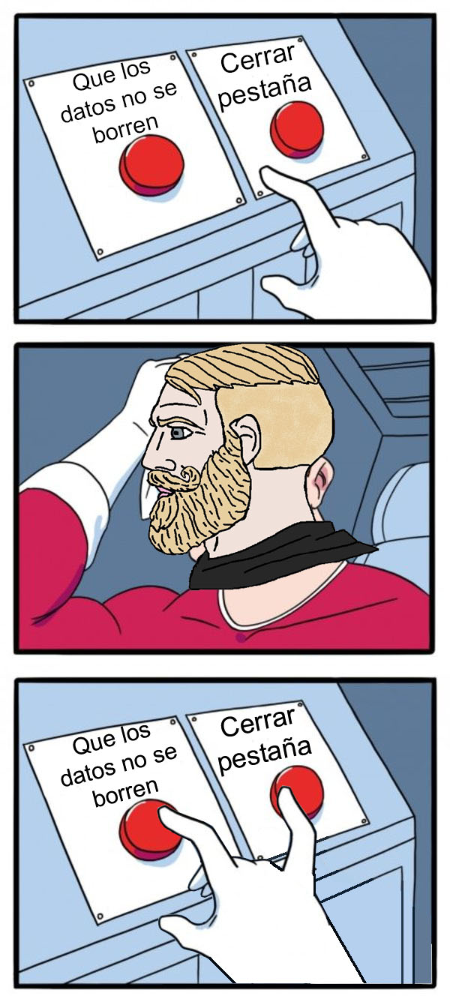

En este pequeño tutorial hablaremos sobre cómo hacer que los datos de la API de Context en React persistan entre visitas utilizando las herramientas que trae el navegador.

[Haremos uno de estos](https://codesandbox.io/s/persistent-context-api-counter-dzggiz)



La API de Context en React te permite crear variables "globales" a las que cualquier componente dentro de tu aplicación tiene acceso, pero no almacena nada en la memoria del navegador, recargas y pum!, todas las variables vuelven a su estado inicial.

## Empecemos con un Hook personalizado

Almacenaremos nuestros datos en la memoria del navegador con la ayuda de la [API de LocalStorage](https://developer.mozilla.org/es/docs/Web/API/Window/localStorage), que está disponible en todos los navegadores.

`localStorage` por sí solo es bastante básico, sólo recibe textos, así que cuando estás leyendo o escribiendo información de ahí que ir convirtiendo los datos.

Este hook personalizado de [sanderdebr](https://dev.to/sanderdebr/building-a-custom-react-localstorage-hook-2bja) que conseguí nos ayudará con eso, utiliza ```JSON.stringify`` y ``JSON.parse`` para leer y escribir nuestros datos y puede ser utilizado como cualquier otro hook dentro de nuestra aplicación:

```ts
//https://dev.to/sanderdebr/building-a-custom-react-localstorage-hook-2bja
const useLocalStorage = (key: string, initialValue: any) => {
    const [storedValue, setStoredValue] = useState(() => {
        try {
            const item = window.localStorage.getItem(key);
            return item ? JSON.parse(item) : initialValue;
        } catch (err) {
            console.error(err);
            return initialValue;
        }
    });

    const setValue = (value: any) => {
        try {
            const valueToStore =
                value instanceof Function ? value(storedValue) : value;
            setStoredValue(valueToStore);
            window.localStorage.setItem(key, JSON.stringify(valueToStore));
        } catch (err) {
            console.error(err);
        }
    };
    return [storedValue, setValue];
};
```

```js
//Using the custom hook
const [niceValue, setNiceValue] = useLocalStorage("keyGoesHere", 69)
```

## Combinando useLocalStorage con la API Context

Un proveedor típico de la API de Context se ve así. Define valores utilizando `useState` y luego los pone a disposición de cada componente hijo.

```jsx
export const DataProvider = ({ children }) => {
    const [counter, setCounter] = useState(0) //Estos valores no persisten entre recargas
    return <DataContext.Provider value={{ counter, setCounter }}>
        {children}
    </DataContext.Provider>
}
```

Y combinado con useLocalStorage queda así:

```jsx
export const DataProvider = ({ children }) => {
    //Nuestro hook personalizado para guardar datos en la memoria del navegador
    const [counterStored, setCounterStored] = useLocalStorage("counter", defaultCounterValue)
    const [counter, _setCounter] = useState(defaultCounterValue)

    //La nueva y mejorada función de SetCounter
    const setCounter = (value) => {
        //Cambia tanto el valor en useState y el de 
        //useLocalStorage para mantenerlos sincronizados
        _setCounter(value)
        setCounterStored(value)
    }

    //Inicializa todas las variables de useState con sus contrapartes en localStorage
    useEffect(() => {
        _setCounter(counterStored)
    }, [])

    return <DataContext.Provider value={{ counter, setCounter }}>
        {children}
    </DataContext.Provider>
}
```

Podemos utilizarlo como lo haríamos normalmente, y su estado se mantendrá a través de las recargas del navegador :O
 ```jsx 
const Counter = () => {
  const { counter, setCounter } = useDataState() 
  return <div className='counter'>
    <p>{counter}</p>
    <button onClick={() => { setCounter(counter - 1) }}>-1</button>
    <button onClick={() => { setCounter(counter + 1) }}>+1</button>
  </div>
}
```

¡Ya ta listo! Ahora tienes un super Context API en esteroides.

¿Quieres intentarlo? [Aquí está el link con el proyecto completo funcionando](https://codesandbox.io/s/persistent-context-api-counter-dzggiz).