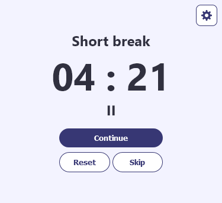
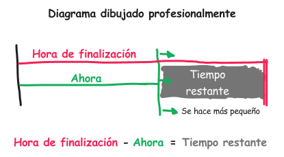
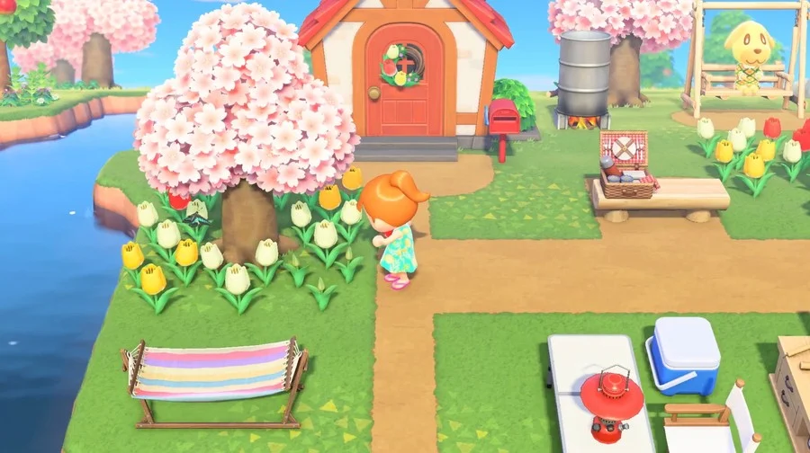
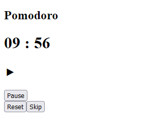
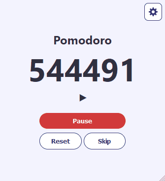
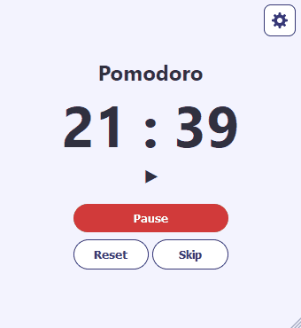

El pomodoro es una técnica de gestión del tiempo que consiste en trabajar durante 25 minutos y descansar 5 minutos. Es un buen truco para trabajar en tareas largas de forma sostenible sin cansarse tanto.

Vamos a hacer uno. Puedes [jurungar el proyecto final](https://pomodoro-context-api.vercel.app/) para familiarizarte sobre cómo funciona y para qué sirve.



## Cosas que ya debes saber:

Para esto usaremos React con la API Context para compartir datos entre componentes fácilmente. Para seguir este tutorial debes estar familiarizado con los conceptos básicos de React, Hooks personalizados y algo de Typescript.

## Requerimientos del programa que haremos.

Existen tres tipos de temporizadores:

- Pomodoro. 25 minutos. 
- Descanso corto. 5 minutos.
- Descanso largo. 10 minutos.

El temporizador funciona con una lista de reproducción que hace un bucle infinito así.

`Pomodoro` > `Descanso corto` > `Pomodoro` > `Descanso corto` > `Pomodoro` > `Descanso corto` > `Pomodoro` > `Descanso largo`

#### Características principales
- Cuando finaliza un temporizador, aparece una notificación.
- Puedes pausar, omitir y reiniciar el temporizador.
- Puedes editar los tiempos de cada temporizador, y la página recuerda la configuración.

#### Este temporizador puede seguir funcionando mientras está cerrado.

Este no es un temporizador cualquiera, utiliza timestamps (marcas de tiempo) como referencia para calcular cuánto tiempo ha pasado.

Por ejemplo, digamos que son las 3:00 pm. Cuando inicias el temporizador, la aplicación guarda un timestamp que llamaremos `endTime` (hora de finalización) con el valor de 3:25 pm. A medida que nos acerquemos a `endTime`, el tiempo restante será cada vez menor.



Ahora. El `endTime` se guarda en la memoria. Cuando cierras la página con el temporizador corriendo y la vuelves a abrir, la página recupera el `endTime` de la memoria y lo utiliza para recalcular el tiempo restante. De esta forma parece como si el temporizador hubiese estado corriendo mágicamente mientras la página estaba cerrada.

Animal Crossing hace esto. Plantas un árbol y apagas la consola, y cuando vuelves al día siguiente el árbol ya creció. El juego seguía avanzando mientras estaba apagado.



## Empieza un nuevo proyecto

Yo usé el framework Next.js, pero puedes usar el React normal si quieres, porque realmente no uso ninguna de las funciones especiales de Next.js 😅. 

Para crear un nuevo proyecto en Next.js simplemente escribe esto en tu consola en la carpeta de tu proyecto.

```bash
npx create-next-app@latest --typescript
```

Next.js viene con soporte para módulos de CSS y una estructura de carpetas razonable con la que puedes empezar.

## Crea una interfaz básica

Ve a tu `pages/index.tsx` y reemplaza todo con esto:

```tsx
import Head from 'next/head'

export default function Home() {
  return (
    <>
      <Head>
        <title>Pomodoro Timer</title>
        <meta name="description" content="This is a pomodoro timer made with Context API" />
        <meta name="viewport" content="width=device-width, initial-scale=1" />
        <link rel="icon" href="/favicon.ico" />
      </Head>
      <main >
        <h2>{"Pomodoro"}</h2>
        <h1>{"09"} : {"56"}</h1>
        <h2>⯈</h2>
        <div >
          <button >Play</button>
          <div>
            <button disabled={false}>Reset</button>
            <button >Skip</button>
          </div>
        </div>
      </main>
    </>
  )
}
```

Lo que tenemos ahí es nuestro título, el temporizador, un indicador del estado y un montón de botones. No voy a cubrir estilos en este post, pero si te quieres inspirar con el diseño lo puedes hacer.



¡Se ve muy bien!

## Configura un proveedor de datos con la API de Context.

Configuraremos un componente proveedor de datos utilizando la API de Context. Este componente hará que todos sus componentes hijos tengan acceso a los datos sin tener que pasarlos como props.

Cree un nuevo archivo llamado `localStorage.tsx` dentro de una carpeta `lib` en la raíz. Empezaremos con un componente simple que sólo exporta un valor llamado `value` y una función llamada `setValue`. Ampliaremos esto a medida que avanzamos.

```tsx
import { createContext, useContext, useState, ReactNode } from 'react';

// crea un tipo para definir la forma del objeto Context, 
// tiene un número llamado value y una funcion llamada setValue.
type LocalStateContextType = {
    value: number,
    setValue: Function,
}

// Crea un objeto Context con la forma definida por LocalStateContextType,
// Establece el valor inicial de value a 0 y un mensaje de advertencia por defecto si 
// si setValue se ejectuta antes de que el Context sea inicializado.
const LocalStateContext = createContext<LocalStateContextType>({
    value: 0,
    setValue: () => console.warn("no local state yet"),
});

const LocalStorageStateProvider = LocalStateContext.Provider;

export default function LocalStorageProvider({ children }: { children: ReactNode }) {
    // establece el estado inicial de value a 0, 
    // y crea una función setValue que puede ser usada para actualizar el estado.
    const [value, setValue] = useState(0)
    
    // renderiza el componente LocalStorageStateProvider y pasa las variables value y setValue
    // adentro del prop llamado value
    return <LocalStorageStateProvider value={{value, setValue }}>
            {children}
        </LocalStorageStateProvider>
}

  // define una función hook que recupera el objeto Context, y lo devuelve.
  function useLocalStorageState() {
    const all = useContext(LocalStateContext);
    return all;
}

export { LocalStorageProvider, useLocalStorageState };
```

Ahora vamos a conectar esta cuestión. Ve a `pages/_app.js` y pon `LocalStorageProvider` para que quede como el padre de todos los componentes dentro de la página. Si estás en React, puedes ponerlo dentro del componente `App`.

```tsx
// pages/_app.js
import '../styles/globals.css'
import type { AppProps } from 'next/app'
import LocalStorageProvider from '../lib/localStorage'

export default function App({ Component, pageProps }: AppProps) {
  return <LocalStorageProvider>
      <Component {...pageProps} />
  </LocalStorageProvider>
}
```

La configuración está lista. Ahora, para usarlo en cualquier archivo que quieras necesitas importar ``useLocalStorageState`` así:

``` tsx
import { useLocalStorageState } from '../lib/localStorage'

const SomeComponent = () => {
    const { value, setValue } = useLocalStorageState()
    return <div>
        <p>{value}</p>
        <button onClick={() => { setValue(value - 1) }}>-1</button>
    </div>
}
```

## Haz que LocalStorageProvider guarde su estado en el navegador

Así es como hacemos posible el truquito de Animal Crossing. Queremos hacer que nuestro ``LocalStorageProvider`` lea y guarde sus datos en la memoria para que pueda restaurar su estado cuando sales de la página.

[Tengo un artículo que explica cómo hacer eso](https://carloshernandez.me/blog/es/persistent-context-api-in-react/), pero el código final debe ser algo como esto:

```tsx
// localStorage.tsx
...
export const LocalStorageProvider = ({ children }) => {
    const [valueStored, setValueStored] = useLocalStorage("value", 0)
    const [value, _setValue] = useState(0)

    const setValue = (val) => {
        _setValue(val)
        setValueStored(val)
    }

    useEffect(() => {
        _setValue(valueStored)
    }, [])

    return <LocalStorageStateProvider value={{ value, setValue }}>
        {children}
    </LocalStorageStateProvider>
}
...
```

Recuerda que también necesitas crear el componente ``useLocalStorage``. Todo está en [el artículo](https://carloshernandez.me/blog/es/persistent-context-api-in-react/).

## Crear los tipos

Esta parte es específica de Typescript. Crearemos algunos de los tipos que necesitaremos a lo largo de la aplicación.

Crea un archivo `types.ts` dentro de una carpeta llamada `shared`.

```ts
// shared/types.ts
// El estado del temporizador.
export enum Status {
    Start = "start"
    Play = "play",
    Pause = "pause",
    Ended = "ended",
}

// Pomodoro, descanso corto y descanso largo son timerTypes
export type timerType = {
    name: String,
    duration: number,
}

// Un objeto que contiene una colección de todos los tipos de temporizadores.
export interface TimerTypes {
    [key: string]: timerType;
}
```

## Crea las constantes

En esa misma carpeta compartida, crea un archivo `constants.ts`.

```ts
// shared/constants.ts
import { TimerTypes } from "./types"

export const defaultTimers: TimerTypes =
{
    pomodoro: {
        name: "Pomodoro",
        duration: 1500000
    },
    longBreak: {
        name: "Long break",
        duration: 600000
    },
    shortBreak: {
        name: "Short break",
        duration: 300000
    }
}

export const initialPlaylist = [
    "pomodoro",
    "shortBreak",
    "pomodoro",
    "shortBreak",
    "pomodoro",
    "shortBreak",
    "pomodoro",
    "longBreak",
]

```

## Crea las variables en nuestro componente LocalStorageProvider.

Ahora mismo, nuestro `LocalStorageProvider` sólo tiene `value` y el setter `setValue`. Vamos a sustituir eso por las variables que necesita nuestro temporizador. Sólo necesitamos 6 variables, con sus respectivos setters.

It will make sense what they are for once we start using them in a sec.

- **timerSettings**: un TimerTypes. (definido en nuestro archivo typescript de antes).
- **playlist**: Una lista de strings.
- **timer**: Un timerType. Este será el temporizador activo.
- **timeRemaining**: Es el tiempo restante en milisegundos.
- **status**: Creamos el enum Status anteriormente.
- **endTime**: Es el tiempo en milisegundos en el que debería terminar el temporizador.

Puedes empezar a crearlos por tu cuenta si quieres practicar un poco con Typescript y la API de Context. Puede que no sepas qué poner en los valores por defecto porque aún no he explicado esa parte, así que cópialos [de aquí](https://github.com/carlos815/pomodoro-context-api/blob/main/lib/localStorage.tsx).

## Importa todas las variables de LocalStateProvider.

Son un montón

```js
// lib/timer.tsx
// ...
const {
        timerSettings,
        playlist,
        setPlaylist,
        timer,
        setTimer,
        timeRemaining,
        setTimeRemaining,
        status,
        setStatus,
        endTime,
        setEndTime
   } = useLocalStorageState()
// ...
```

## Crea otro proveedor de Context

Ahora crearemos otro proveedor de contenido llamado `TimerProvider`. Mientras que el primero sólo almacenaba datos, éste contendrá la lógica real que nuestro temporizador necesita para funcionar.

TimerProvider exporta las funciones `playPause`, `reset` y `skip`, y el valor de `now`.

```jsx
// lib/timer.tsx
import { createContext, useContext, useState, ReactNode } from 'react';

export type LocalStateContextType = {
    playPause: Function,
    reset: Function,
    skip: Function,
    now: number,
}

export const LocalStateContext = createContext<LocalStateContextType>({
    playPause: () => console.warn("no local state yet"),
    reset: () => console.warn("no local state yet"),
    skip: () => console.warn("no local state yet"),
    now: 0,
});

export const LocalStateProvider = LocalStateContext.Provider;

export default function TimerProvider({ children }: { children: ReactNode }) {
    const [now, setNow] = useState(0)
    const playPause = () => {}
    const reset = () => {}
    const skip = () => {}

    return <LocalStateProvider value={{playPause, reset, skip, now}}>
        {children}</LocalStateProvider>
}

function useTimer() {
    const all = useContext(LocalStateContext);
    return all;
}

export { TimerProvider, useTimer };
```

También necesitarás conectar éste a tu componente raíz [así](https://github.com/carlos815/pomodoro-context-api/blob/main/pages/_app.tsx)

## Actualiza el valor de nuestra variable `now` (ahora).

Si vuelves al diagrama dibujado profesionalmente de antes, nuestra variable `now` está representada por una línea verde que siempre se mueve hacia delante. Esto es sólo el tiempo actual en milisegundos. Puedes acceder a ella con `Date.now()` en el navegador.

Usaremos un `useEffect` para actualizar el valor dentro del navegador. Lo pondremos dentro de un `setInterval` para que el valor se actualice cada 250 milisegundos, o 1/4 de segundo:
```js
// lib/timer.tsx
// ...
useEffect(() => {
    const interval = setInterval(() => {
        setNow(Date.now())
    }, 250)
    return () => clearInterval(interval)
}, [])
// ...
```

## La función de Play

Cuando presionamos play, el estado del temporizador tiene que cambiar a play. Eso lo podemos hacer con `setStatus(Status.Play)`.

En segundo lugar, queremos calcular el `endTime`, la hora en la que va a terminar el temporizador, y almacenar ese valor. Así que tenemos que sumar el tiempo restante a `now`. Hay un valor llamado `timeRemaining` que importamos de nuestro `useLocalStorageState` que podemos utilizar.
```jsx
const play = () => {
    setStatus(Status.Play)
    setEndTime(timeRemaining + now)
}
```

#### Ahora si, para qué son las variables en useLocalStorageState

###### timerSettings:

Esta empieza siendo igual al `defaultTimers` que tenemos en [nuestro archivo de constantes](https://github.com/carlos815/pomodoro-context-api/blob/main/shared/constants.ts). Define los nombres de los temporizadores y la duración de cada uno.

```ts    
const [timerSettings, _setTimerSettings] = useState<TimerTypes>(defaultTimers)
```

###### timer:

Este es el temporizador actualmente activo. Utiliza el primer elemento en [playlist](https://github.com/carlos815/pomodoro-context-api/blob/main/shared/constants.ts) como clave para buscar los valores en timerSettings.

```ts    
const [timer, _setTimer] = useState<timerType>(timerSettings[playlist[0]])
```

###### timeRemaining:

El tiempo restante. Su valor inicial es la duración del `timer`.

```ts    
const [timeRemaining, _setTimeRemaining] = useState<number>(timer.duration)
```

## La función de pausa

Cunado presionamos pausa, se tiene que poner el estado del temporizador en pausa y se tiene que actualizar el tiempo restante.

```jsx
const pause = () => {
    setStatus(Status.Pause)
    setTimeRemaining(endTime - now)
}
```

El `timeRemaining` será la diferencia entre el `endTime` y el `now`. El área gris en el diagrama de antes.


## Las funciones para los botones.

Nuestra aplicación sólo tiene tres botones, playPause, reset y skip. Vamos a crear funciones para ellos.

#### playPause

Esta función necesita hacer cosas diferentes dependiendo del estado actual del temporizador. Esta es una buena excusa para usar la sentencia switch de javascript.

```jsx
 const playPause = () => {
        switch (status) {
            case Status.Start:
            case Status.Pause:
                play()
                break
            case Status.Play:
                pause()
                break      
            case Status.Ended:
                skip() //Esta no la hemos creado todavía
                break
            default:
                console.error("Play status not recognized")
        }
    }
```

#### Reset

Esta función restaura `timeRemaining` a su valor inicial y establece el `status` a `start`.

```tsx
const reset = () => {
    setStatus(Status.Start)
    setTimeRemaining(timer.duration)
}
```
#### Skip

Esta función agarra el primer elemento en `playlist` y lo pone último. Luego utiliza el primer elemento de la matriz modificada para configurar un nuevo temporizador.

Entonce esto

`1` > `2` > `3` > `4`

Se convierte en esto

`4` > `1` > `2` > `3`

```tsx
const skip = () => {
    //Sending the first item in the playlist to the last spot
    const _playlist = playlist;
    const _firstItem = _playlist[0]
    _playlist.shift()
    _playlist.push(_firstItem)
    setPlaylist(_playlist)

    //Create a new timer using the new first item in the playlist as a key in timerSettings
    const newTimer = timerSettings[_playlist[0]]
    setUpNewTimer(newTimer)
}

const setUpNewTimer = (newTimer: timerType) => {
    setTimer(newTimer)
    setTimeRemaining(newTimer.duration)
    setStatus(Status.Start)
}
```

## La función ended

Ok esta es la última función, lo prometo. Esto es lo que pasa cuando el temporizador llega a su fin. El estado se establece en ended, y una notificación aparece.

```tsx
const ended = () => {
    setStatus(Status.Ended)
    setTimeRemaining(0)
    //Debemos reproducir una notificación aquí
}
```

Podemos comprobar si el temporizador ha llegado a cero cada vez que `now` cambia para activar la función `ended`.

```jsx
useEffect(() => {
    // This is a listener of sorts.
    if (status == Status.Play && (endTime - now) < 0) {
        ended()
    }
}, [now])
```

Ok eso fue un montón de código. Nuestro `lib/timer.tsx` debería verse [así](https://github.com/carlos815/pomodoro-context-api/blob/main/lib/timer.tsx)


## Creando la interfaz

Ahora por fin, POR FIN, podremos mostrar algo en nuestra aplicación.

Ve a tu `pages/index.tsx` e importa el `useTimer` y el `useLocalStorageState`.

```tsx
import { useLocalStorageState } from '../lib/localStorage'
import { useTimer } from '../lib/timer'
...
export default function Home() {
  const { playPause, reset, skip, now } = useTimer()
  const { status, timeRemaining, endTime, timer } = useLocalStorageState()
...
```

Empecemos por la parte difícil. El temporizador.

#### El indicador del tiempo.

Crea esta constante:
```tsx
  const onScreenTime = status == Status.Play ? endTime - now : timeRemaining
```

Traducción: Cuando el temporizador está en marcha, se muestra `endTime - now`, que se actualiza cada 250 ms. Cuando el temporizador no está en marcha, se muestra `timeRemaining`, que se actualiza cada vez que llamamos a `setTimeRemaining`.

Este tiempo se muestra en milisegundos. Podrías simplemente tirar `onScreenTime` en la interfaz y listo, pero no somos cavernícolas.



Convertiremos ese desastre en segundos y minutos. Estas funciones te ayudarán:

```tsx
const minDigits = (numStr: String, digits: Number) => {
  while (numStr.length < digits) {
    numStr = '0' + numStr
  }
  return numStr
}

const getMinutes = (timeStamp: number, digits = 2): String => {
  return minDigits((Math.floor((timeStamp) / 1000 / 60 % 99)).toString(), digits)
}

const getSeconds = (timeStamp: number, digits = 2): String => {
  return minDigits((Math.floor((timeStamp) / 1000 % 60)).toString(), digits)
}
```

Ahora en nuestra interfaz, hacemos esto:

```tsx
<h1 >{getMinutes(onScreenTime)} : {getSeconds(onScreenTime)}</h1>
```

#### Todo lo demás

Ahora puedes mostrar dinámicamente el nombre del temporizador actual.

```tsx
<h2>{timer.name}</h2>
```

Y poner las funciones playPause, reset y skip en sus respectivos botones.

```tsx
...
<div >
      <button onClick={() => {playPause()}}>Play</button>
      <div>
        <button onClick={() => {reset()}} >Reset</button>
        <button onClick={() => {skip()}}>Skip</button>
      </div>
</div>
...
```

Puede utilizar el `status` para mostrar algo diferente dependiendo del valor.

```tsx
const statusIndicator = () => {
  switch (status) {
    case Status.Start:
      return "-- "
    case Status.Play:
      return "⯈"
    case Status.Pause:
      return "❙❙"
    case Status.Ended:
      return "✓"
    default:
      return "--"
  }
}
```
And then.
```tsx
<h2>{statusIndicator()}</h2>
```
Si quieres hacer algo más sofisticado que eso, como usar íconos SGVs, es más organizado si creas un componente separado que pueda recibir `status` como un prop u agarrarlo de `useLocalStorageState`.

## El toque final. Las notificaciones.

Un temporizador que no avisa cuando termina es bien inutl. Arreglemos eso.

Crea un archivo llamado notifications.js en tu carpeta lib con esto:

```js
// lib/notifications.js
export const requestNotificationPermission = () => {
  if (Notification.permission !== 'granted') {
    Notification.requestPermission(function (status) {
      console.log('Notification permission status:', status)
    })
  }
}

export const displayNotification = (text, options) => {
  if (Notification.permission === 'granted') {
    Notification.onclick = (event) => {
      event.preventDefault(); // prevent the browser from focusing the Notification's tab
      window.open('http://www.mozilla.org', '_blank');
    }
    new Notification(text, {
      icon: '../tomato-icon.png', //Your own icon here. Put it in the public folder
      ...options,
    })
  }
}
```

Para poder enviar una notificación es necesario pedir permiso al usuario. Para eso tenemos la función `requestNotificationPermission`. Sólo puedes hacerlo después de que el usuario haya interactuado con la página. Así que podrías ponerlo en la función `playPause`.

```tsx
// lib/timer.tsx
const playPause = () => {
      requestNotificationPermission() //Aquí!
      switch (status) {
          (...)
      }
  }
```

Luego puede enviar notificaciones una vez que el temporizador ha terminado con `displayNotification`.

```tsx
// lib/timer.tsx
const ended = () => {
      displayNotification(`${timer.name} ended.`, { body: "You are doing great!" }) //Aquí!
      setStatus(Status.Ended)
      setTimeRemaining(0)
  }
```

Para más información sobre cómo funcionan esas dos funciones recomiendo [el artículo de Mozilla sobre eso](https://developer.mozilla.org/en-US/docs/Web/API/notification).

## ¡Concluyendo!

Bueno este ha sido mi post más largo hasta ahora. si te pierdes durante todo esto, no te culpo, porque eso fue bastante información. Puedes chismear el [código fuente](https://github.com/carlos815/pomodoro-context-api) con confianza.

Si quieres ampliar este proyecto, puedes intentar añadirle sonidos, la posibilidad de cambiar la duración de los temporizadores e incluso un historial para poder ver los temporizadores completados.

Espero que te haya resultado útil. Gracias por leer. 


