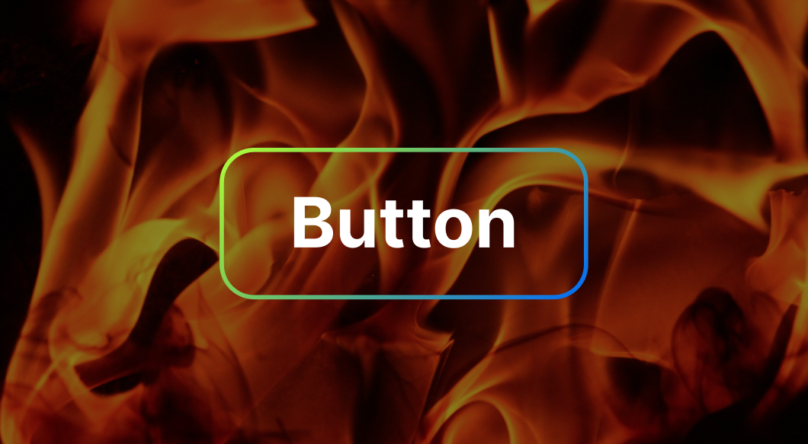
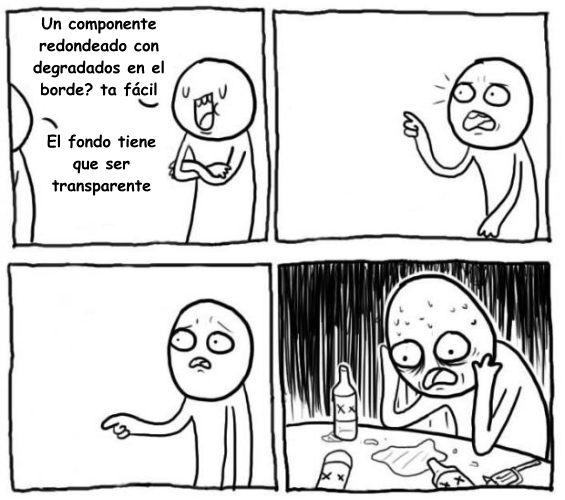
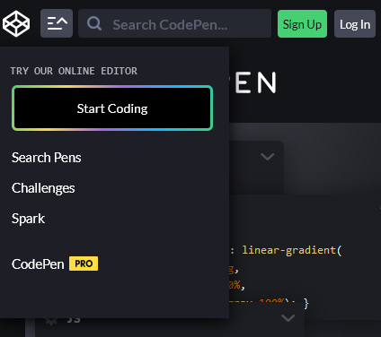
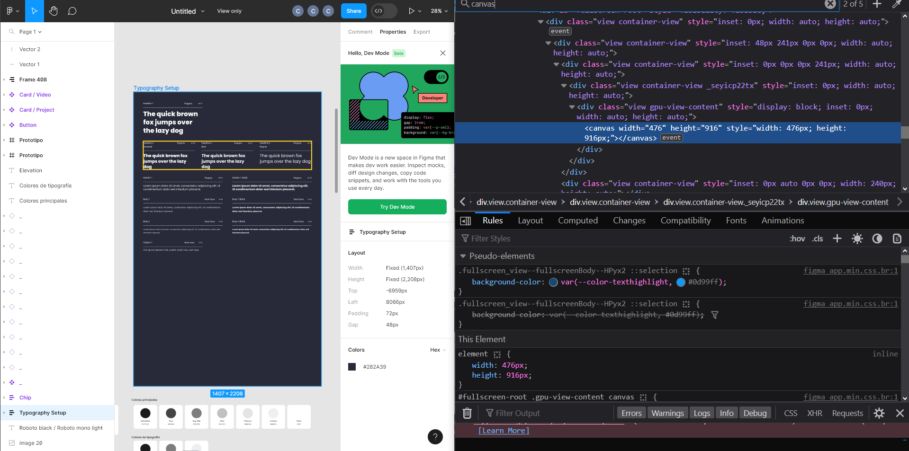

_Si no te interesa mi habladera y sólo vienes por el código, aquí lo tienes en todo su esplendor_:
```scss
//style.scss
$border-radius: 4px;
$border-width: 1px;
.button {
    display: flex;
    color: white;
    position: relative;
    z-index: 0;
    border-radius: $border-radius;
    padding: 8px 16px;

    &::before {
        border-radius: $border-radius;
        content: "";
        position: absolute;
        z-index: -1;
        inset: 0;
        padding: $border-width; //El ancho del borde va en la propiedad de padding
        background: linear-gradient(to top right, #ADFF00, #0066FF);
        -webkit-mask:
            linear-gradient(#fff 0 0) content-box,
            linear-gradient(#fff 0 0);
        mask:
            linear-gradient(#fff 0 0) content-box,
            linear-gradient(#fff 0 0);
        -webkit-mask-composite: xor;
        mask-composite: exclude;
    }
}
```
---


Hace poco en el trabajo me encargaron una tarea aparentemente sencilla: Hacer un botón con un borde degradado. El botón tiene bordes redondeados y es transparente.



Super fácil. CSS no admite gradientes en su propiedad de borde, pero esto no es nada que no se pueda resolver unos parapeteos clásicos de front-end:

Sólo tienes que usar un elemento ``::before`` que tenga el degradado y luego cubrir la mayor parte con el fondo del botón para que sólo se vea el borde.



## La cosa es ese fondo transparente.

Esta tarea me hizo entrar en las cinco fases del luto, y después de perder más tiempo del que estoy dispuesto a admitir, y de consultar con el resto del equipo de front-end, tuve que pronunciar las vergonzosas cuatro palabras que ningún programador de front-end quiere decir a un diseñador:

> No se puede hacer

[Deshonrada mi vaca](https://www.youtube.com/watch?v=AW7iAIzRSQ4).

Llegamos a un acuerdo: cambiar el fondo transparente por uno negro, que, hay que admitirlo, se veía idéntico en la mayoría de las situaciones en las que se utilizaba el botón.

En mi pequeña reunión de deshonor y vergüenza con el equipo de diseño, utilicé la página de Codepen como ejemplo, para convencerlos (y convencerme) de que, efectivamente, era algo imposible de hacer dado el estado actual de CSS.



Pero no podía superarlo, cada vez que veía el botón, era un recordatorio de mi fracaso. Tenía que haber una manera. Un mes después, caí en el mismo espiral, y me propuse resolver el problema de una vez por todas.

## Primera pista, Figma 🕵️‍♀️

Mi primer enfoque fue utilizar la herramienta de inspección del navegador para averiguar qué rayos está haciendo Figma por dentro, esa gente hace degradados de bordes redondeados como si nada, y lo hacen todo en un navegador.



No encontré nada 🙁. Todo en Figma está dentro de un `<canvas>`.

Figma tiene su propio motor de renderizado 2D en [Web Assembly](https://www.figma.com/blog/webassembly-cut-figmas-load-time-by-3x/), así que no usan divs y javascript como el resto de los mortales.


## Segunda pista, la propiedad border-image.

La página CSS-tricks tiene [todo un artículo sobre las propiedades gradient border](https://css-tricks.com/gradient-borders-in-css/), el problema es que el artículo es de 2018.

Hablan de la propiedad `border-image` de CSS. Tienen un [demo](https://codepen.io/chriscoyier/pen/ZVYXRx) donde muestran los bordes degradados con el fondo transparente, pero los bordes no son redondeados.


Ellos dicen que la propiedad no es compatible con `border-radius`, pero eso fue en 2018, capaz lo actualizaron y ya funciona.

[NARRADOR: No funciona.]

## El escalado de 9 regiones

El artículo de CSS-tricks me mandó para otra espiral.

El [escalado de 9 regiones](https://en.wikipedia.org/wiki/9-slice_scaling) es una técnica para redimensionar imágenes 2D dividiendo la imagen en 9 partes. Creo que es lo que usaban los juegos de Pokemon viejos para los bordes de los cuadros de diálogo (énfasis en 'creo').


Esto es algo que [CSS soporta](https://developer.mozilla.org/en-US/docs/Web/CSS/border-image-slice) con la propiedad `border-image-slice`. Que yo sepa, solo se ha usado para hacer unos bordes todos feos que parecen salidos directamente de 1995.

Así que tal vez, si divido el botón en nueve partes, y luego encuentro el color exacto en cada uno de los puntos de corte, puedo hacer un SGV independiente para cada sección. Entonces las uno usando `border-image-slice`. De esa manera se escalará y todo. ¡Va a quedar perfecto!


Estuve peligrosamente cerca de ejecutar ese plan, pero tenía demasiadas desventajas. Para empezar, cambiar los colores, los radios de los bordes o incluso el ancho, me habría obligado a rehacer todos los SGV. Además, si alguien hubiese leido mi código, se hubiese dado cuenta que yo lo que estoy es loco.

## Entonces vi la luz

[Temani Afif](https://stackoverflow.com/users/8620333/temani-afif), que se autodenomina un hacker de CSS experto (yo le creo), hizo [un post en Stack Overflow](https://stackoverflow.com/questions/51496204/border-gradient-with-border-radius) que por alguna razón tardé mucho tiempo en encontrar.

Todo se puede hacer usando [la propiedad Mask](https://developer.mozilla.org/en-US/docs/Web/CSS/mask).

```scss
...
padding: $border-width;
background: linear-gradient(to top right, #ADFF00, #0066FF);
mask: linear-gradient(#fff 0 0) content-box,
      linear-gradient(#fff 0 0);
mask-composite: exclude;
...
```

El código completo lo puse al principio.

Puedes usar un pseudoelemento `::before` con el gradiente, igual que mi plan inicial, pero puedes cortar el centro usando máscaras. Luego, para configurar el ancho, puedes usar la propiedad padding.

Ya. Eso es todo. Es demasiado sencillo una vez tienes la respuesta.

Después de que finalmente lo hice, presenté el resultado a la gente del equipo de diseño con orgullo, como si acabara de resolver el calentamiento global, y no se veían muy impresionados. 

> Meh. El equipo de diseño - 2023

Al parecer esa era una tarea que ya estaba cerrada, y ya habían dejado de pensar en ese botón hace tiempo. La versión anterior con el fondo negro se veía casi igual, y ya se habían acostumbrado a ese estilo después de verlo durante tanto tiempo.

Un mes después, cambiaron el botón por uno más sencillo que no usa degradados 🤡.