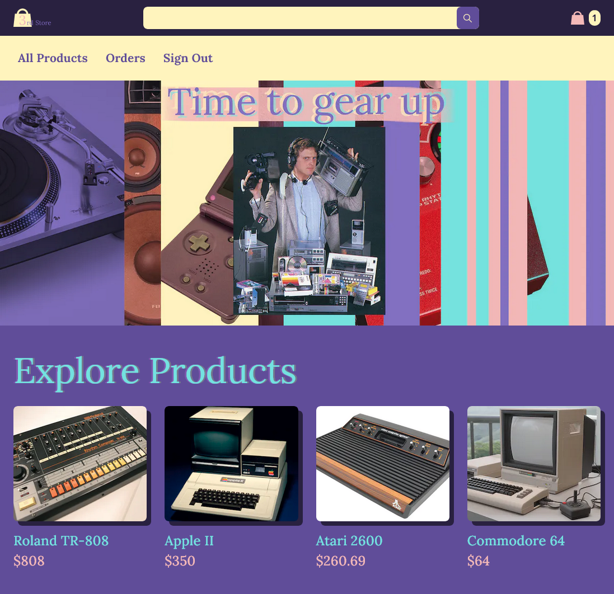
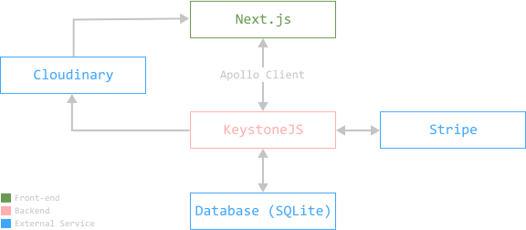
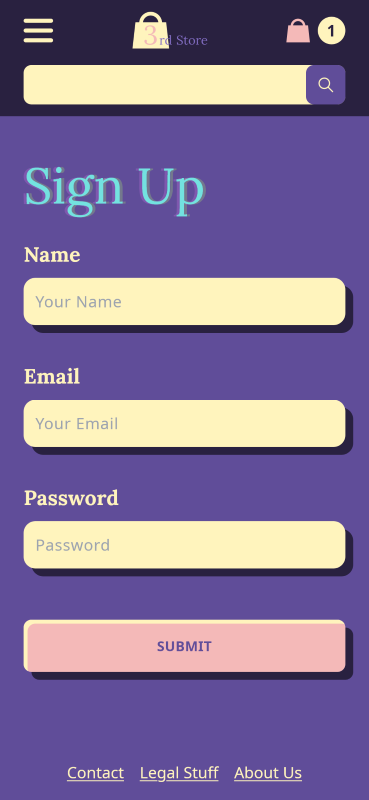

> Hey kid, wanna' create your own fully customizable and modular eshop without
> Shopify for free? I also have free candy

Normally, you shouldn't take offers like that seriously, but this is 2023. Web development has come a long way, and this is not as crazy as it sounds.


In this post I'll explain EVERYTHING* you need to know to build **your own functional online store using only free stuff**.

\*Ok not *everything*, this won't be a fully-fledged tutorial (that'll come later if there's demand for it), but an overview of all of the technologies that you need to get you started. You can use this as a general guide, with links to the official documentation where you'll find the most up to date information to apply these ideas.

I made [a fake online store](https://3rd-shop.vercel.app/) using these concepts. As you can see, it works, so I'm not totally full of BS.



[This](https://github.com/carlos815/3rd-shop-frontend) is the source code for the frontend.

[This](https://github.com/carlos815/3rd-shop-backend) is the source code for the backend.

And [this](https://www.figma.com/file/9ggHbHWHxIXkcL0kUdF5Q0/3rd-Shop?node-id=9%3A241&t=QSw2DVPTPc4OyzmR-1) is my design in Figma.

I spent an embarrassing amount of hours trying to figure all of this out, even after paying for this [Wes Bos' course](https://advancedreact.com) about it. 


## Why not just use Shopify?

Shopify is actually great, they are like the Wordpress of online shop, and I say that as a compliment.


### They have good things:
- A *very* robust Content Management System (CMS for the cool kids).
- Payment handling.
- Hosting. Period. This includes the actual store page that you visit, the database with the product information, the image hosting... 
- Lots of plugins for a lot of common scenarios.
- And even store design templates, for small businesses that don't need a web designer.


### But they have bad things too:

- Their service understandably costs money.
- They are very limited in terms of customization.

This means that if we find an alternative for at least the CMS, the payment handling and the hosting, we can have our candy and eat it too (I guess I'm sticking to the shady van with candies example for some reason).

## What other tech can we use?

I present to you the official poor man's stack for eshop development.



Our tech stack goes as follows:
 - **Next.js**. A React library for our front end.
 - **Apollo Client**. How the front end interacts with the backend.
 - **KeystoneJS**. The backend. It includes the CMS.
 - **SQLite**. The database. For production you need to change this to either Postgres or MySQL.
 - **Cloudinary**. The Image hosting service.
 - **Stripe**. The payment processor.

## Checklist to build your eshop

**Note**: *You'll have two projects that you need to work on, the Front end with Next.js and the backend with KeystoneJS. That means at least two windows. If you are using VSCode you can use [this extension](https://marketplace.visualstudio.com/items?itemName=stuart.unique-window-colors) to auto generate window colors. This makes it easier to tell them apart when you are switching constantly between them.*

### Initial Setup:

1. [**Create a new Next.js project**](https://nextjs.org/docs/getting-started) and [**a new KeystoneJS project**](https://keystonejs.com/docs/getting-started). 
3. [**Install the Apollo Client on your Next.js project**](https://www.apollographql.com/docs/react/get-started#step-2-install-dependencies).
4. [**Connect the Apollo Client to Keystone**](https://www.apollographql.com/blog/apollo-client/next-js/next-js-getting-started/#creating-a-new-next-js-app). Remember to go to your ``pages/_app.js`` and wrap the ``<Component {...pageProps} />`` with an ApolloProvider. It's all in the link.
5. **Tell Keystone the url of your frontend**. Otherwise [Mr. Cors](https://developer.mozilla.org/en-US/docs/Web/HTTP/CORS) will yell at you. Just copy [Keystone's example](https://keystonejs.com/docs/config/config#server) and replace the url.
6. **Try out a [query in Next.js](https://www.apollographql.com/docs/react/data/queries/) to see if it connects**. By default, the server has posts, so you could create a post in the Keystone CMS and query them with: 
```graphQl
query {
  posts {
    title
    content {
      document
    }
  }
}
```

### Custom schemas:

Schemas are data models. By default, KeystoneJS comes with schemas for users and posts. For our store we need product items, cart items, orders and order items. 

1. [**Install and configure Cloudinary Image in your backend**](https://keystonejs.com/docs/fields/cloudinaryimage). You'll need to create a Cloudinary account to get those API keys.
2. [**Create a custom schema for your product images**](https://github.com/carlos815/3rd-shop-backend/blob/main/schemas/ProductImage.ts).  After it's configured, the images you upload through the KeystoneJS CMS will be automatically uploaded to Cloudinary (very cool).
3. [**Create a custom schema for products**](https://github.com/carlos815/3rd-shop-backend/blob/main/schemas/Product.ts). The sky is the limit here. Your product can have a name, description, one or multiple images (from your custom product images schema), a price, a user they belong to, stock inventory, relationship status, social security numbers or covid vaccine status.
4. **Create a custom schema for everything else**. You need at least cart items, orders, and order items. [I have em' here](https://github.com/carlos815/3rd-shop-backend/tree/main/schemas).

### User authentication:
Authentication should work out of the box in the backend, [they've got a bunch of mutations and queries](https://keystonejs.com/docs/config/auth) to help you implement user authentication on your page very quickly. 




1. **Create a sign in page**.  The mutation to log in is called ``authenticateUserWithPassword``. See it in use [here](https://github.com/carlos815/3rd-shop-frontend/blob/main/pages/signin.tsx).
2. **Create a sign up/register page**. [There's a mutation for creating users](https://keystonejs.com/docs/graphql/overview#create-user). Example [here](https://github.com/carlos815/3rd-shop-frontend/blob/main/pages/signup.tsx).
3. **Check if user is logged in or not, to show different things on the page**. You can query ``authenticatedItem`` to check for that. You can even [create a custom hook](https://github.com/carlos815/3rd-shop-frontend/blob/main/components/User.js) so you can check if the user is logged in within any component to change the UI accordingly. 
4. **Create a sign out button**. There's a mutation called ``endSession`` that just logs out the user. [Here's a button](https://github.com/carlos815/3rd-shop-frontend/blob/main/components/SignOut.jsx) that uses it.

### Implement the Cart:

> The "cart" doesn't really exists, it's not stored somewhere, it's just a concept 🤯

Nah, but seriously, you don't need to have a schema for "Cart" that contains cart items. It's possible to fetch a collection of "Cart Items" belonging to a particular user, that's your cart.

1. [**Create custom mutations for adding and removing cart items**](https://keystonejs.com/docs/guides/schema-extension#using-keystone-s-graphql-extend). The front end should just give it the id of the product, and the backend should handle the rest, creating the cart item for that user, and if it's already created, then add one to the quantity. [Like this](https://github.com/carlos815/3rd-shop-backend/blob/main/mutations/addToCart.ts).
2. [**Use your custom mutations in the frontend**](https://github.com/carlos815/3rd-shop-frontend/blob/main/pages/product/%5Bid%5D.tsx). 


### Payments with Stripe:

> We don't handle credit card data directly, that's a big no-no, Stripe handles that for us

Stripe is not free, but they charge on each transaction, which means you can start developing with it for free.

1. **Configure Stripe on your backend**. [Install it](https://stripe.com/docs/api?lang=node) and then create a config file with the API key [like this one](https://github.com/carlos815/3rd-shop-backend/blob/main/lib/stripe.ts). You'll need [a Stripe account](https://dashboard.stripe.com/register) to get that API key.
2. **Create a custom mutation for the checkout**. The checkout mutation does A LOT. The frontend just sends the Stripe token and that's it, everything else is handled by the backend. The backend then calculates the total value of the order based on the user's cart, puts the order in the Stripe, and if the order goes through, it empties the cart, and creates an order with all of that information (by "order" I mean [a custom schema called order](https://github.com/carlos815/3rd-shop-backend/blob/main/schemas/Order.ts)). [Here's the code for that](https://github.com/carlos815/3rd-shop-backend/blob/main/mutations/checkout.ts), with each step commented and such.
3. [**Install and configure the checkout with Stripe**](https://stripe.com/docs/stripe-js/react) in the frontend. [Here](https://github.com/carlos815/3rd-shop-frontend/blob/main/components/Checkout.jsx)'s a functioning example. Stripe provides an input where the user enters their credit card info. 

## Is that All?

Not it's not. :) We still need to figure out the hosting, and a bunch of smaller things, but hopefully this was a nice overview of one of the ways you can approach a project like this one.

If you want to venture into that, and try it for yourself, you can use my code ([or Wes', of the tutorial I learned with](https://github.com/wesbos/Advanced-React)) as a starting point or as a cheat sheet.

😊